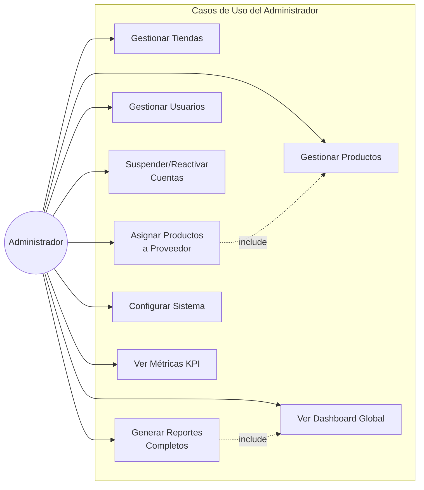
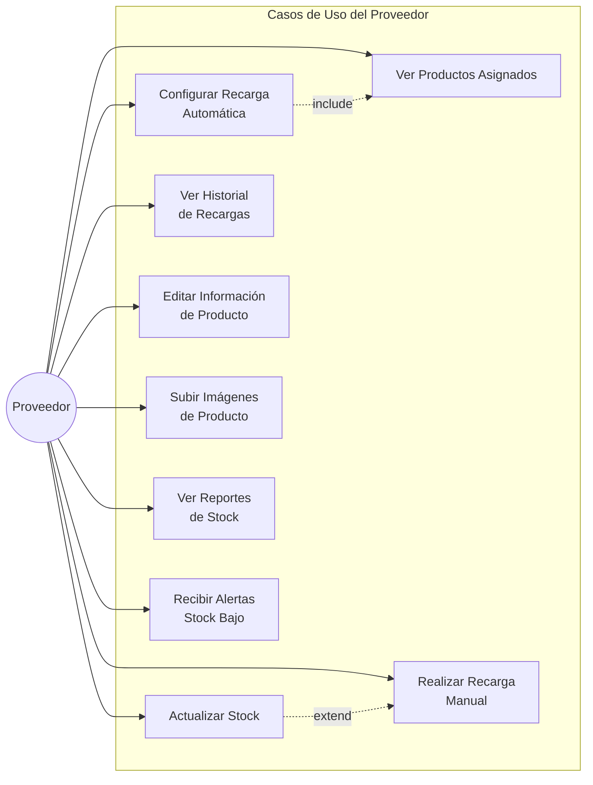
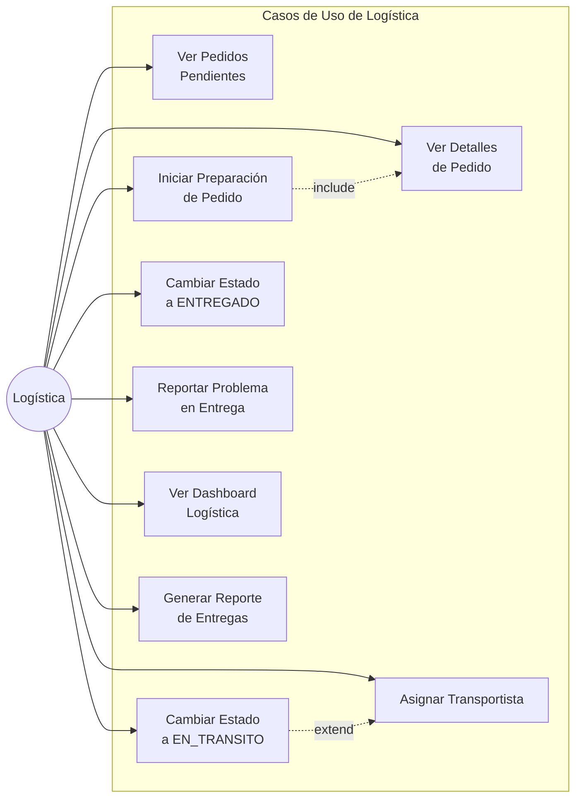
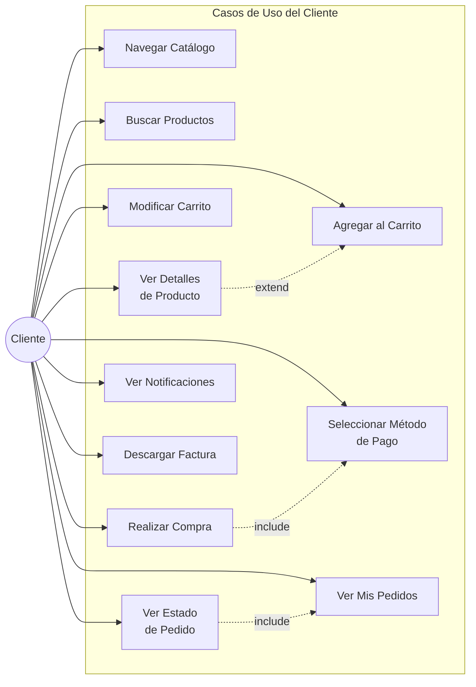

# 🎭 DIAGRAMAS DE CASOS DE USO - PREXCOL

**Proyecto**: PREXCOL  
**Fecha**: 2025-12-04  
**Tipo**: Diagramas de Comportamiento - Requisitos

---

## 📋 ÍNDICE

1. [Vista General del Sistema](#vista-general-del-sistema)
2. [Casos de Uso por Actor](#casos-de-uso-por-actor)
3. [Especificaciones Detalladas](#especificaciones-detalladas)

---

## 🎯 VISTA GENERAL DEL SISTEMA

```mermaid
graph LR
    %% Actors on the Left
    Admin((Administrador))
    Proveedor((Proveedor))
    Logistica((Logística))
    Cliente((Cliente))
    Sistema_Ext[Sistema Externo]

    %% System Boundary
    subgraph Sistema_PREXCOL["SISTEMA PREXCOL"]
        direction TB
        
        subgraph Autenticacion["Módulo de Autenticación"]
            UC1[Registrarse]
            UC2[Iniciar Sesión]
            UC3[Recuperar Contraseña]
            UC4[Cambiar Contraseña]
            UC5[Gestionar Cuenta]
        end

        subgraph Productos["Módulo de Productos"]
            UC6[Gestionar Tiendas]
            UC7[Gestionar Productos]
            UC8[Asignar Productos]
            UC9[Navegar Catálogo]
            UC10[Buscar Productos]
        end

        subgraph Stock["Módulo de Stock"]
            UC11[Configurar Recarga Auto]
            UC12[Recargar Stock Manual]
            UC13[Ver Historial Recargas]
            UC14[Monitorear Stock]
        end

        subgraph Pedidos["Módulo de Pedidos"]
            UC15[Crear Pedido]
            UC16[Procesar Pago]
            UC17[Gestionar Pedidos]
            UC18[Cambiar Estado Pedido]
            UC19[Ver Mis Pedidos]
        end

        subgraph Ventas["Módulo de Ventas"]
            UC20[Generar Venta]
            UC21[Ver Historial Ventas]
            UC22[Generar Reportes]
        end

        subgraph Administracion["Módulo de Administración"]
            UC26[Gestionar Usuarios]
            UC27[Suspender Cuenta]
            UC28[Ver Dashboard]
            UC29[Configurar Sistema]
        end
        
        subgraph Notificaciones["Módulo de Notificaciones"]
            UC23[Enviar Notificación]
            UC24[Ver Notificaciones]
            UC25[Marcar como Leída]
        end
    end

    %% Relationships - Organized to reduce crossing
    %% Admin Connections
    Admin --> UC1
    Admin --> UC2
    Admin --> UC6
    Admin --> UC7
    Admin --> UC8
    Admin --> UC22
    Admin --> UC26
    Admin --> UC27
    Admin --> UC28
    
    %% Provider Connections
    Proveedor --> UC1
    Proveedor --> UC2
    Proveedor --> UC7
    Proveedor --> UC11
    Proveedor --> UC12
    Proveedor --> UC13
    Proveedor --> UC14
    Proveedor --> UC22
    
    %% Logistica Connections
    Logistica --> UC1
    Logistica --> UC2
    Logistica --> UC17
    Logistica --> UC18
    Logistica --> UC28
    
    %% Client Connections
    Cliente --> UC1
    Cliente --> UC2
    Cliente --> UC9
    Cliente --> UC10
    Cliente --> UC15
    Cliente --> UC16
    Cliente --> UC19
    Cliente --> UC24

    %% Include/Extend
    UC16 -.-> Sistema_Ext
    UC23 -.-> Sistema_Ext
```




---

## 👥 CASOS DE USO POR ACTOR

### 📌 Actor: Administrador



### 📦 Actor: Proveedor



### 🚚 Actor: Logística



### 🛒 Actor: Cliente



---

## 📝 ESPECIFICACIONES DETALLADAS

### UC-001: Registrarse

**Actor**: Todos (Cliente, Proveedor, Logística, Admin)  
**Descripción**: El usuario se registra en el sistema creando una nueva cuenta.

**Precondiciones**:
- El usuario no está autenticado
- Email no existe en el sistema

**Flujo Principal**:
1. Usuario accede a página de registro
2. Usuario completa formulario (email, nombre, contraseña, rol)
3. Sistema valida datos ingresados
4. Sistema verifica que email sea único
5. Sistema valida fortaleza de contraseña
6. Sistema crea nueva cuenta de usuario
7. Sistema guarda contraseña en historial
8. Sistema envía email de bienvenida
9. Sistema muestra mensaje de éxito
10. Sistema redirige a página de login

**Flujos Alternativos**:
- **3a.** Datos inválidos:
  - Sistema muestra errores de validación
  - Retorna a paso 2
- **4a.** Email ya existe:
  - Sistema muestra error "Email ya registrado"
  - Retorna a paso 2
- **5a.** Contraseña débil:
  - Sistema muestra requisitos de contraseña
  - Retorna a paso 2

**Postcondiciones**:
- Nuevo usuario creado en base de datos
- Email de bienvenida enviado
- Usuario puede iniciar sesión

---

### UC-002: Crear Pedido

**Actor**: Cliente  
**Descripción**: El cliente crea un nuevo pedido seleccionando productos del catálogo.

**Precondiciones**:
- Usuario autenticado como Cliente
- Catálogo tiene productos activos
- Al menos un producto tiene stock disponible

**Flujo Principal**:
1. Cliente navega catálogo de productos
2. Cliente selecciona producto
3. Sistema muestra detalles del producto
4. Cliente agrega producto al carrito (+cantidad)
5. Sistema valida stock disponible
6. Sistema agrega producto al carrito
7. Cliente continúa comprando (repite 2-6) o procede al pago
8. Cliente revisa carrito
9. Cliente confirma pedido
10. Sistema valida stock de todos los items
11. Sistema muestra opciones de pago
12. Cliente selecciona método de pago
13. Cliente ingresa datos de pago
14. Sistema procesa pago (ver UC-016)
15. Sistema crea pedido con estado "pendiente"
16. Sistema reduce stock de productos
17. Sistema envía notificaciones
18. Sistema muestra confirmación con número de pedido

**Flujos Alternativos**:
- **5a.** Stock insuficiente:
  - Sistema muestra error "Stock insuficiente"
  - Retorna a paso 2
- **10a.** Stock cambió antes de confirmar:
  - Sistema muestra productos sin stock
  - Permite ajustar carrito
  - Retorna a paso 8
- **14a.** Pago rechazado:
  - Sistema muestra error de pago
  - Permite intentar otro método
  - Retorna a paso 11

**Postcondiciones**:
- Pedido creado en base de datos
- Stock reducido
- Pago registrado
- Notificaciones enviadas

---

### UC-008: Asignar Productos a Proveedor

**Actor**: Administrador  
**Descripción**: El administrador asigna productos del catálogo a un proveedor específico.

**Precondiciones**:
- Usuario autenticado como Administrador
- Existen productos en el sistema
- Existen usuarios con rol "proveedor"

**Flujo Principal**:
1. Admin accede a módulo de productos
2. Admin selecciona producto a asignar
3. Sistema muestra información actual del producto
4. Admin selecciona opción "Asignar Proveedor"
5. Sistema muestra lista de proveedores activos
6. Admin selecciona proveedor
7. Admin confirma asignación
8. Sistema valida proveedor activo
9. Sistema actualiza producto con nuevo proveedor
10. Sistema pregunta si configurar recarga automática
11. Si sí, admin configura stock_minimo y cantidad_recarga
12. Sistema guarda configuración
13. Sistema envía notificación al proveedor
14. Sistema registra cambio en auditoría
15. Sistema muestra mensaje de éxito

**Flujos Alternativos**:
- **8a.** Proveedor inactivo o suspendido:
  - Sistema muestra error
  - Retorna a paso 6
- **10a.** No configurar recarga automática:
  - Salta al paso 13

**Postcondiciones**:
- Producto asignado a proveedor
- Config de stock creada (opcional)
- Proveedor notificado
- Cambio auditado

---

### UC-018: Cambiar Estado de Pedido

**Actor**: Logística  
**Descripción**: El personal de logística cambia el estado de un pedido durante su ciclo de vida.

**Precondiciones**:
- Usuario autenticado como Logística
- Pedido existe
- Transición de estado es válida

**Flujo Principal**:
1. Logística accede a panel de pedidos
2. Sistema muestra pedidos por estado
3. Logística selecciona pedido
4. Sistema muestra detalles del pedido
5. Logística selecciona nuevo estado
6. Sistema valida transición permitida
7. Logística confirma cambio
8. Sistema actualiza estado del pedido
9. Si estado = "entregado", sistema genera registro de venta
10. Sistema envía notificación al cliente
11. Sistema actualiza métricas
12. Sistema muestra confirmación

**Reglas de Transición**:
- pendiente → preparando
- preparando → en_transito
- en_transito → entregado
- cualquier_estado → cancelado (con justificación)

**Flujos Alternativos**:
- **6a.** Transición inválida:
  - Sistema muestra error "Transición no permitida"
  - Muestra estado actual y estados permitidos
  - Retorna a paso 5
- **8a.** Error al actualizar:
  - Sistema muestra error
  - Mantiene estado anterior
  - Registra error en log

**Postcondiciones**:
- Estado del pedido actualizado
- Venta generada (si entregado)
- Cliente notificado
- Métricas actualizadas

---

### UC-011: Configurar Recarga Automática

**Actor**: Proveedor, Administrador  
**Descripción**: Configurar el sistema de recarga automática de stock para un producto.

**Precondiciones**:
- Usuario autenticado como Proveedor o Admin
- Producto existe y está asignado al proveedor
- Producto no tiene recarga automática o se quiere modificar

**Flujo Principal**:
1. Usuario accede a gestión de productos
2. Usuario selecciona producto
3. Usuario selecciona opción "Configurar Recarga Automática"
4. Sistema muestra formulario de configuración
5. Usuario ingresa stock_minimo (umbral)
6. Usuario ingresa cantidad_recarga
7. Usuario activa/desactiva recarga_automatica
8. Usuario confirma configuración
9. Sistema valida datos ingresados
10. Sistema guarda o actualiza stock_config
11. Sistema muestra mensaje de confirmación
12. Sistema inicia monitoreo automático

**Validaciones**:
- stock_minimo > 0
- cantidad_recarga > 0
- cantidad_recarga > stock_minimo (recomendado)

**Flujos Alternativos**:
- **9a.** Datos inválidos:
  - Sistema muestra errores
  - Retorna a paso 5
- **7a.** Desactiva recarga automática:
  - Sistema mantiene config pero no ejecuta recargas
  - Salta a paso 10

**Postcondiciones**:
- Configuración guardada
- Sistema monitoreará stock según config
- Recargas se ejecutarán automáticamente cuando aplique

---

### UC-022: Generar Reportes

**Actor**: Admin, Proveedor, Logística  
**Descripción**: Generar reportes personalizados según rol del usuario.

**Precondiciones**:
- Usuario autenticado
- Existen datos para generar reporte

**Flujo Principal**:
1. Usuario accede a módulo de reportes
2. Sistema muestra tipos de reporte disponibles según rol
3. Usuario selecciona tipo de reporte
4. Sistema muestra opciones de filtro
5. Usuario establece filtros (fechas, categorías, etc.)
6. Usuario selecciona formato (PDF, Excel, CSV)
7. Usuario solicita generar reporte
8. Sistema consulta base de datos
9. Sistema procesa y agrega datos
10. Sistema genera gráficos/visualizaciones
11. Sistema formatea reporte según formato seleccionado
12. Sistema descarga archivo
13. Sistema guarda en historial de reportes

**Tipos de Reporte por Rol**:

**Administrador**:
- Reporte de ventas global
- Reporte de stock de todas las tiendas
- Reporte de usuarios por rol
- Reporte de pedidos por estado
- Reporte financiero
- Métricas y KPIs globales

**Proveedor**:
- Reporte de productos asignados
- Reporte de historial de recargas
- Reporte de stock actual
- Productos con stock bajo
- Proyección de demanda

**Logística**:
- Reporte de pedidos por estado
- Reporte de tiempos de entrega
- Reporte de problemas en entregas
- Métricas de rendimiento

**Flujos Alternativos**:
- **8a.** No hay datos para el filtro:
  - Sistema muestra mensaje "No hay datos"
  - Permite ajustar filtros
  - Retorna a paso 5
- **11a.** Error al generar reporte:
  - Sistema muestra error
  - Permite reintentar o cambiar formato

**Postcondiciones**:
- Reporte generado y descargado
- Registro en historial
- Datos auditados

---

## 🔗 RELACIONES ENTRE CASOS DE USO

### Relaciones <<include>>

```
UC-015 (Crear Pedido) <<include>> UC-016 (Procesar Pago)
UC-018 (Cambiar Estado) <<include>> UC-020 (Generar Venta)
UC-022 (Generar Reportes) <<include>> UC-028 (Ver Dashboard)
UC-008 (Asignar Productos) <<include>> UC-007 (Gestionar Productos)
```

### Relaciones <<extend>>

```
UC-003 (Recuperar Contraseña) <<extend>> UC-002 (Iniciar Sesión)
UC-012 (Recarga Manual) <<extend>> UC-011 (Configurar Recarga Auto)
UC-010 (Buscar Productos) <<extend>> UC-009 (Navegar Catálogo)
```

### Relaciones de Generalización

```
UC-028 (Ver Dashboard) generalized by:
  - UC-028A (Dashboard Admin)
  - UC-028B (Dashboard Proveedor)
  - UC-028C (Dashboard Logística)
  - UC-028D (Dashboard Cliente)
```

---

## 📊 MATRIZ DE CASOS DE USO POR ACTOR

| Caso de Uso | Admin | Proveedor | Logística | Cliente |
|-------------|-------|-----------|-----------|---------|
| **Autenticación** ||||
| UC-001 Registrarse | ✅ | ✅ | ✅ | ✅ |
| UC-002 Iniciar Sesión | ✅ | ✅ | ✅ | ✅ |
| UC-003 Recuperar Contraseña | ✅ | ✅ | ✅ | ✅ |
| UC-004 Cambiar Contraseña | ✅ | ✅ | ✅ | ✅ |
| UC-005 Gestionar Cuenta (Ver Perfil, Configurar) | ✅ | ✅ | ✅ | ✅ |
| UC-005a Desactivar Cuenta | ✅ | ✅ | ✅ | ✅ |
| UC-005b Cambiar Tema/Idioma | ✅ | ✅ | ✅ | ✅ |
| **Productos & Stock** ||||
| UC-006 Gestionar Tiendas | ✅ | - | - | - |
| UC-007 Gestionar Productos | ✅ | ✅ | - | - |
| UC-008 Asignar Productos | ✅ | - | - | - |
| UC-009 Navegar Catálogo | ✅ | ✅ | ✅ | ✅ |
| UC-010 Buscar Productos | ✅ | ✅ | ✅ | ✅ |
| UC-011 Configurar Recarga Auto | ✅ | ✅ | - | - |
| UC-012 Recargar Stock Manual | ✅ | ✅ | - | - |
| UC-013 Ver Historial Recargas | ✅ | ✅ | - | - |
| UC-014 Monitorear Stock | ✅ | ✅ | - | - |
| **Pedidos** ||||
| UC-015 Crear Pedido | - | - | - | ✅ |
| UC-016 Procesar Pago | - | - | - | ✅ |
| UC-017 Gestionar Pedidos | ✅ | - | ✅ | - |
| UC-018 Cambiar Estado | - | - | ✅ | - |
| UC-019 Ver Mis Pedidos | - | - | - | ✅ |
| **Ventas & Reportes** ||||
| UC-020 Generar Venta | - | - | ✅ | - |
| UC-021 Ver Historial Ventas | ✅ | - | - | ✅ |
| UC-022 Generar Reportes | ✅ | ✅ | ✅ | - |
| **Notificaciones** ||||
| UC-023 Enviar Notificación | Sistema | Sistema | Sistema | Sistema |
| UC-024 Ver Notificaciones | ✅ | ✅ | ✅ | ✅ |
| UC-025 Marcar como Leída | ✅ | ✅ | ✅ | ✅ |
| **Administración** ||||
| UC-026 Gestionar Usuarios | ✅ | - | - | - |
| UC-027 Suspender Cuenta | ✅ | - | - | - |
| UC-028 Ver Dashboard | ✅ | ✅ | ✅ | ✅ |
| UC-029 Configurar Sistema | ✅ | - | - | - |

---

**Documento generado**: 2025-12-04  
**Versión**: 1.0  
**Estado**: ✅ Completado
