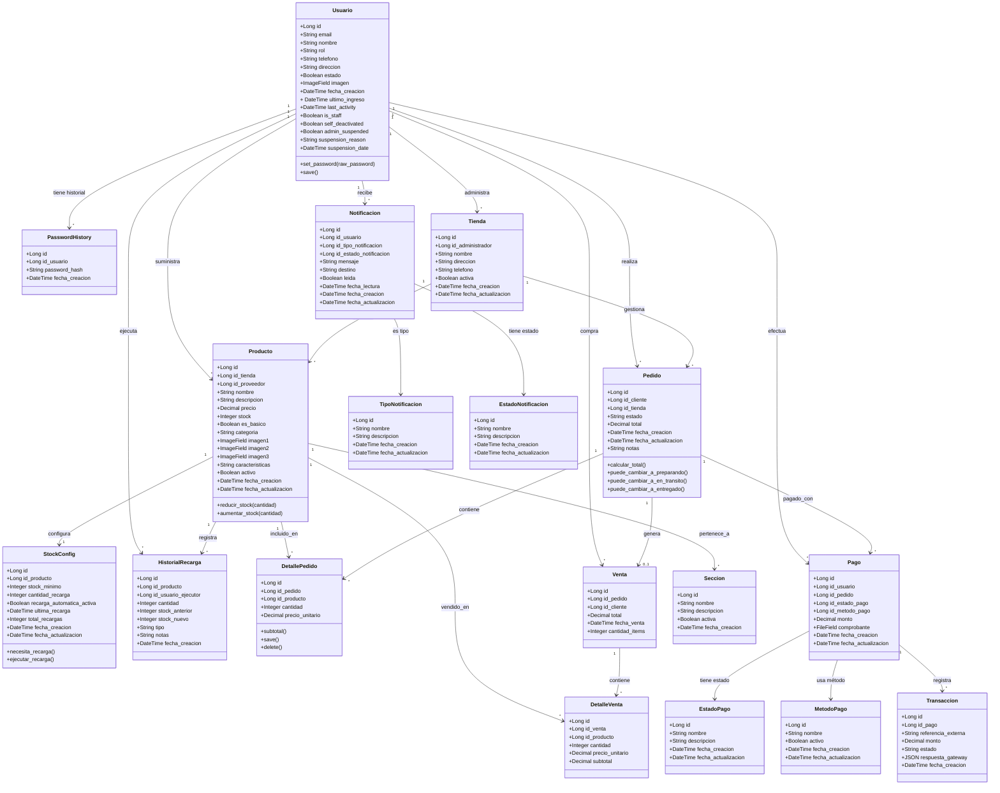

# 📐 DIAGRAMA DE CLASES - PREXCOL

**Proyecto**: PREXCOL  
**Fecha**: 2025-12-04  
**Tipo**: Diagrama Estructural - Modelo de Dominio

---

## 📋 MODELO DE DOMINIO COMPLETO

### Diagrama de Clases Principal




---

## 🎯 DESCRIPCIÓN POR MÓDULO

### **Módulo: Usuarios**

#### Usuario
**Responsabilidad**: Gestionar la autenticación, autorización y datos de usuarios del sistema.

**Atributos Principales**:
- `rol`: Enum (admin, proveedor, logistica, cliente)
- `self_deactivated`: Flag para auto-desactivación
- `admin_suspended`: Flag para suspensión por admin

**Métodos Clave**:
- `set_password()`: Valida contraseña vs historial
- `save()`: Guarda historial de contraseñas

#### PasswordHistory
**Responsabilidad**: Mantener historial de contraseñas para evitar reutilización.

---

### **Módulo: Productos**

#### Tienda
**Responsabilidad**: Representar puntos de venta físicos.

**Relaciones**:
- Un administrador puede gestionar múltiples tiendas
- Una tienda contiene múltiples productos

#### Producto
**Responsabilidad**: Gestionar el catálogo de productos.

**Atributos Principales**:
- `stock`: Cantidad disponible
- `es_basico`: Marca productos de necesidad básica
- `categoria`: Clasificación del producto
- `imagen1, imagen2, imagen3`: Múltiples imágenes

**Métodos Clave**:
- `reducir_stock()`: Valida y reduce stock
- `aumentar_stock()`: Incrementa stock

#### StockConfig
**Responsabilidad**: Configurar recarga automática de stock.

**Atributos Principales**:
- `stock_minimo`: Umbral de recarga
- `cantidad_recarga`: Cantidad a agregar
- `recarga_automatica_activa`: Flag de activación

**Métodos Clave**:
- `necesita_recarga()`: Verifica si debe recargarse
- `ejecutar_recarga()`: Ejecuta la recarga

#### HistorialRecarga
**Responsabilidad**: Auditoría de recargas de stock.

**Atributos Principales**:
- `tipo`: Enum (automatica, manual)
- `stock_anterior`, `stock_nuevo`: Trazabilidad

---

### **Módulo: Ventas**

#### Pedido
**Responsabilidad**: Gestionar órdenes de compra.

**Atributos Principales**:
- `estado`: Enum (pendiente, preparando, en_transito, entregado, cancelado)
- `total`: Total calculado automáticamente

**Métodos Clave**:
- `calcular_total()`: Suma detalles del pedido
- `puede_cambiar_a_*()`: Valida transiciones de estado

#### DetallePedido
**Responsabilidad**: Ítems individuales de un pedido.

**Características**:
- Relación M2M entre Pedido y Producto
- Guarda precio_unitario en momento de compra
- Calcula subtotal automáticamente

#### Venta
**Responsabilidad**: Registro consolidado de venta completada.

**Características**:
- Se genera cuando pedido es entregado
- Desnormaliza datos para reportes rápidos

#### DetalleVenta
**Responsabilidad**: Detalles de productos vendidos.

---

### **Módulo: Pagos**

#### Pago
**Responsabilidad**: Gestionar transacciones de pago.

**Atributos Principales**:
- `comprobante`: Archivo de comprobante (opcional)
- `monto`: Monto de la transacción

#### Transaccion
**Responsabilidad**: Detalles de transacción con gateway.

**Atributos Principales**:
- `referencia_externa`: ID del gateway
- `respuesta_gateway`: JSON completo de respuesta

#### EstadoPago
**Responsabilidad**: Catálogo de estados de pago.

**Valores Típicos**: Pendiente, Aprobado, Rechazado, Reembolsado

#### MetodoPago
**Responsabilidad**: Catálogo de métodos de pago.

**Valores Típicos**: Tarjeta, Transferencia, PSE, Efectivo

---

### **Módulo: Notificaciones**

#### Notificacion
**Responsabilidad**: Gestionar notificaciones a usuarios.

**Atributos Principales**:
- `leida`: Flag de lectura
- `fecha_lectura`: Timestamp de lectura
- `destino`: Email o ID de usuario

#### TipoNotificacion
**Responsabilidad**: Catálogo de tipos de notificación.

**Valores Típicos**: Pedido, Pago, Stock, Sistema

#### EstadoNotificacion
**Responsabilidad**: Catálogo de estados de notificación.

**Valores Típicos**: Pendiente, Enviada, Fallida

---

## 🔗 PATRONES DE DISEÑO APLICADOS

### 1. **Factory Pattern**
- `UsuarioManager.create_user()` y `create_superuser()`
- Crea instancias de Usuario con configuración específica por rol

### 2. **Strategy Pattern**
- Métodos de pago intercambiables
- Tipos de notificación configurables

### 3. **Observer Pattern**
- Notificaciones automáticas al cambiar estado de pedido
- Recarga automática de stock al detectar umbral

### 4. **Repository Pattern**
- ViewSets de Django REST actúan como repositorios
- Abstracción de acceso a datos

### 5. **Template Method**
- `save()` y `delete()` sobrescritos en DetallePedido
- Define esqueleto del algoritmo

---

## 📊 CARDINALIDADES CLAVE

| Relación | Cardinalidad | Descripción |
|----------|--------------|-------------|
| Usuario → Tienda | 1:N | Un admin gestiona N tiendas |
| Usuario → Producto | 1:N | Un proveedor suministra N productos |
| Tienda → Producto | 1:N | Una tienda tiene N productos |
| Producto → StockConfig | 1:1 | Un producto tiene una config |
| Pedido → DetallePedido | 1:N | Un pedido tiene N ítems |
| Pedido → Venta | 1:0..1 | Un pedido genera 0 o 1 venta |
| Producto → DetallePedido | 1:N | Un producto en N pedidos |

---

## 🎯 INVARIANTES DEL MODELO

### Usuario
- Email debe ser único
- Roles válidos: admin, proveedor, logistica, cliente
- Si admin_suspended=True, usuario no puede autenticarse

### Producto
- Stock >= 0 siempre
- (nombre, tienda) debe ser único
- Si recarga_automatica_activa=True, debe tener StockConfig

### Pedido
- Total debe ser suma de detalles
- Transiciones de estado válidas:
  - pendiente → preparando
  - preparando → en_transito
  - en_transito → entregado
- No puede haber DetallePedido duplicados (mismo producto)

### Pago
- Monto debe coincidir con total del pedido
- Si método requiere comprobante, debe tenerlo

---

## 📝 NOTAS DE IMPLEMENTACIÓN

### Índices de Base de Datos
```python
# Usuario
indexes = [
    ('rol', 'estado'),
    ('email', 'estado'),
    ('-fecha_creacion',)
]

# Producto
indexes = [
    ('tienda', 'activo'),
    ('proveedor', 'activo')
]

# Pedido
indexes = [
    ('cliente', 'estado'),
    ('tienda', 'estado'),
    ('estado', '-fecha_creacion')
]

# HistorialRecarga
indexes = [
    ('producto', '-fecha_creacion'),
    ('tipo', '-fecha_creacion')
]
```

### Unique Constraints
```python
# Producto
unique_together = ('nombre', 'tienda')

# DetallePedido
unique_together = ('pedido', 'producto')
```

---

## 🚀 EXTENSIONES FUTURAS

### Versión 2.0
- [ ] `ProductoVariante` (tallas, colores)
- [ ] `Promocion` y `Descuento`
- [ ] `Carrito` persistente
- [ ] `Wishlist`

### Versión 3.0
- [ ] `Review` y `Rating`
- [ ] `Recomendacion` (IA)
- [ ] `Suscripcion` recurrente
- [ ] `Programa` de fidelización

---

**Documento generado**: 2025-12-04  
**Versión**: 1.0  
**Estado**: ✅ Completado
