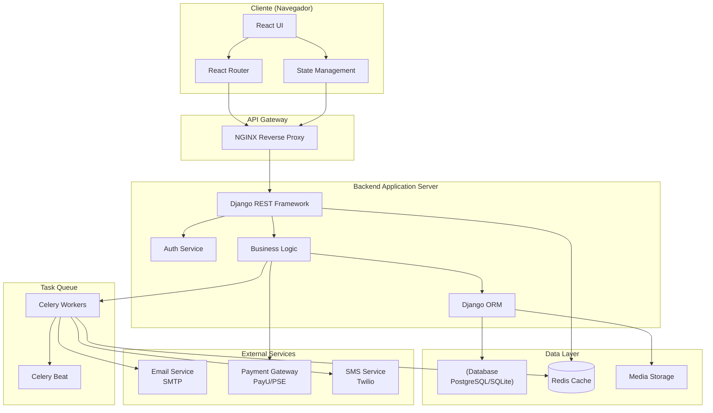
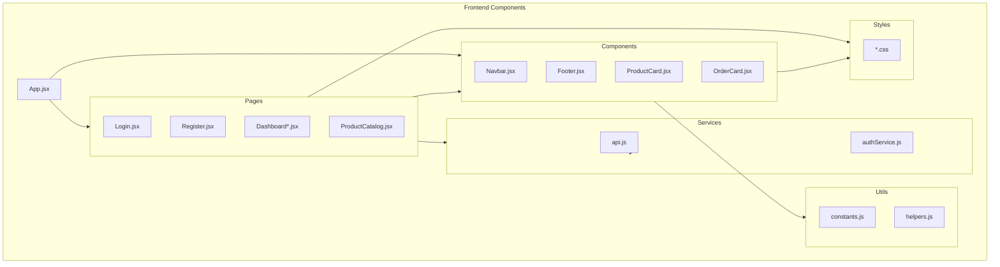
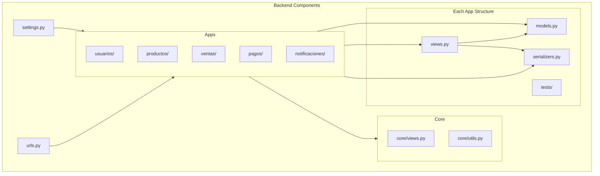
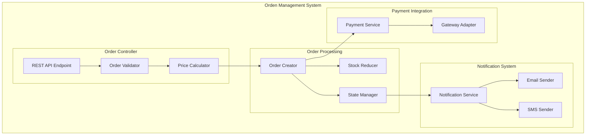
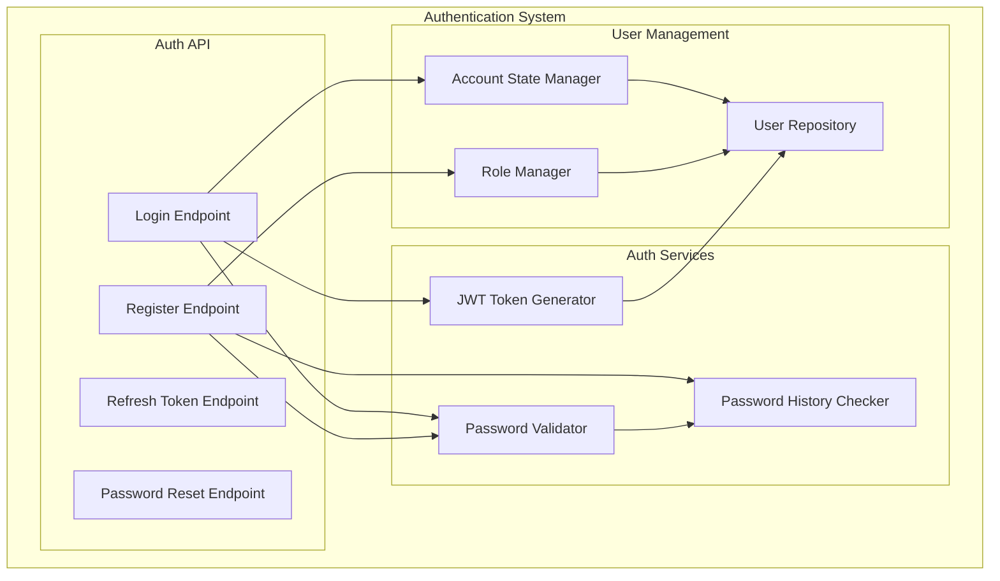
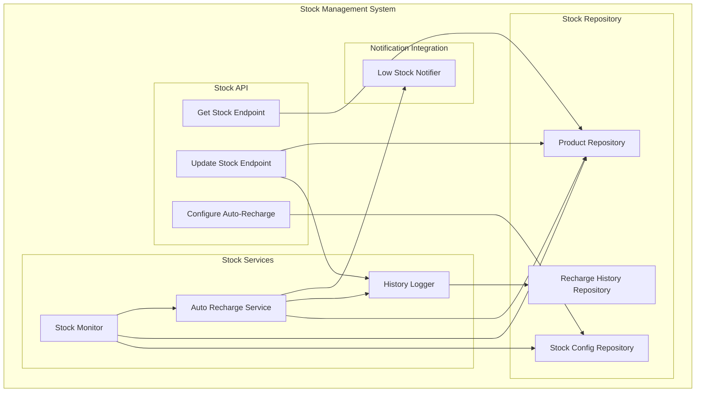
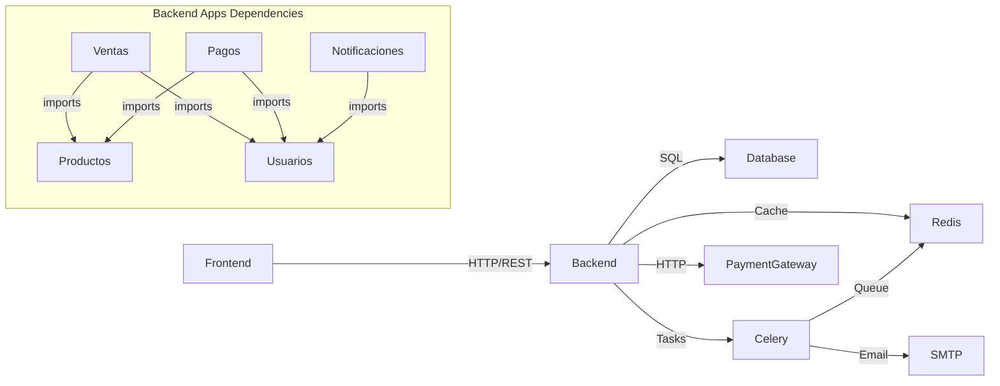

# 📦 DIAGRAMAS DE COMPONENTES Y PAQUETES - PREXCOL

**Proyecto**: PREXCOL  
**Fecha**: 2025-12-04  
**Tipo**: Diagramas Estructurales

---

## 📋 ÍNDICE

1. [Diagrama de Componentes](#diagrama-de-componentes)
2. [Diagrama de Paquetes](#diagrama-de-paquetes)
3. [Diagrama de Estructura Compuesta](#diagrama-de-estructura-compuesta)

---

## 🏗️ DIAGRAMA DE COMPONENTES


### Vista de Alto Nivel



### Componentes Frontend



### Componentes Backend



---

## 📦 DIAGRAMA DE PAQUETES

### Estructura General del Proyecto

```
┌─────────────────────────────────────────────────────────────┐
│                        PREXCOL                              │
├─────────────────────────────────────────────────────────────┤
│                                                             │
│  ┌──────────────────┐         ┌──────────────────┐         │
│  │    Frontend      │────────>│     Backend      │         │
│  │   (React App)    │   HTTP  │  (Django App)    │         │
│  └──────────────────┘         └──────────────────┘         │
│         │                              │                    │
│         │                              │                    │
│  ┌──────▼──────────┐         ┌────────▼─────────┐         │
│  │   src/          │         │   backend/       │         │
│  ├─────────────────┤         ├──────────────────┤         │
│  │ • pages/        │         │ • apps/          │         │
│  │ • components/   │         │   - usuarios/    │         │
│  │ • services/     │         │   - productos/   │         │
│  │ • styles/       │         │   - ventas/      │         │
│  │ • utils/        │         │   - pagos/       │         │
│  │ • utils/        │         │   - notificaciones/│         │
│  └─────────────────┘         │ • core/          │         │
│                              │ • scripts/       │         │
│                              └──────────────────┘         │
│                                       │                    │
│                               ┌───────▼──────────┐         │
│                               │    Database      │         │
│                               │  (SQLite/PG)     │         │
│                               └──────────────────┘         │
└─────────────────────────────────────────────────────────────┘
```

### Paquete: Frontend

```
frontend/
│
├── public/
│   ├── index.html
│   └── assets/
│
├── src/
│   ├── main.jsx ────────────────┐ Entry Point
│   ├── App.jsx ─────────────────┤ Root Component
│   │                            │
│   ├── pages/ ──────────────────┤ Views/Pages
│   │   ├── login.jsx           │
│   │   ├── Register.jsx        │
│   │   ├── DashboardAdmin.jsx  │
│   │   ├── DashboardProveedor.jsx
│   │   ├── DashboardLogistica.jsx
│   │   ├── DashboardCliente.jsx
│   │   ├── ProductCatalog.jsx  │
│   │   ├── ForgotPassword.jsx  │
│   │   └── ResetPassword.jsx   │
│   │                            │
│   ├── components/ ─────────────┤ Reusable Components
│   │   ├── Navbar.jsx          │
│   │   ├── Footer.jsx          │
│   │   ├── ProductCard.jsx     │
│   │   ├── OrderCard.jsx       │
│   │   ├── LoadingSpinner.jsx  │
│   │   └── ErrorBoundary.jsx   │
│   │                            │
│   ├── services/ ───────────────┤ API Services
│   │   ├── api.js              │
│   │   └── authService.js      │
│   │                            │
│   ├── styles/ ─────────────────┤ CSS Modules
│   │   ├── Login.css           │
│   │   ├── Dashboard.css       │
│   │   └── index.css           │
│   │                            │
│   └── utils/ ──────────────────┘ Helpers
│       ├── constants.js
│       └── helpers.js
│
└── package.json
```

### Paquete: Backend

```
backend/
│
├── manage.py ──────────────────┐ Django CLI
│                               │
├── backend/ ───────────────────┤ Project Config
│   ├── __init__.py            │
│   ├── settings.py            │
│   ├── urls.py                │
│   └── wsgi.py                │
│                               │
├── apps/ ──────────────────────┤ Django Apps
│   │                          │
│   ├── usuarios/ ─────────────┤ Auth & Users
│   │   ├── models.py          │
│   │   ├── serializers.py     │
│   │   ├── views/             │
│   │   │   ├── views.py       │
│   │   │   ├── view_login.py  │
│   │   │   └── view_password.py
│   │   ├── tests/             │
│   │   └── migrations/        │
│   │                          │
│   ├── productos/ ────────────┤ Products & Stock
│   │   ├── models.py          │
│   │   │   • Tienda           │
│   │   │   • Producto         │
│   │   │   • Pedido           │
│   │   │   • DetallePedido    │
│   │   │   • StockConfig      │
│   │   │   • HistorialRecarga │
│   │   ├── serializers.py     │
│   │   ├── views.py           │
│   │   ├── tests/             │
│   │   └── migrations/        │
│   │                          │
│   ├── ventas/ ───────────────┤ Sales
│   │   ├── models.py          │
│   │   │   • Venta            │
│   │   │   • DetalleVenta     │
│   │   ├── serializers.py     │
│   │   ├── views.py           │
│   │   ├── tests/             │
│   │   └── migrations/        │
│   │                          │
│   ├── pagos/ ────────────────┤ Payments
│   │   ├── models.py          │
│   │   │   • Pago             │
│   │   │   • Transaccion      │
│   │   │   • EstadoPago       │
│   │   │   • MetodoPago       │
│   │   ├── serializers.py     │
│   │   ├── views.py           │
│   │   ├── tests/             │
│   │   └── migrations/        │
│   │                          │
│   └── notificaciones/ ───────┤ Notifications
│       ├── models.py          │
│       │   • Notificacion     │
│       │   • TipoNotificacion │
│       │   • EstadoNotificacion
│       ├── serializers.py     │
│       ├── views.py           │
│       ├── tasks.py ──────────┤ Celery Tasks
│       ├── tests/             │
│       └── migrations/        │
│                              │
├── core/ ──────────────────────┤ Shared Utils
│   ├── models.py              │
│   ├── views.py               │
│   └── utils.py               │
│                              │
├── scripts/ ───────────────────┤ Management Scripts
│   ├── test_jwt.py            │
│   └── verify_new_features.py │
│                              │
└── requirements.txt ───────────┘ Dependencies
```

---

## 🔧 DIAGRAMA DE ESTRUCTURA COMPUESTA

### Componente: Sistema de Pedidos



### Componente: Sistema de Autenticación



### Componente: Sistema de Stock



---

## 🎯 INTERFACES ENTRE COMPONENTES

### Frontend ↔ Backend

```typescript
// API Interface
interface IAPIService {
    // Auth
    login(credentials: Credentials): Promise<AuthResponse>
    register(userData: UserData): Promise<UserResponse>
    refreshToken(token: string): Promise<TokenResponse>
    
    // Products
    getProducts(filters: ProductFilters): Promise<Product[]>
    getProduct(id: number): Promise<ProductDetail>
    
    // Orders
    createOrder(order: OrderData): Promise<OrderResponse>
    getOrders(userId: number): Promise<Order[]>
    updateOrderStatus(orderId: number, status: OrderStatus): Promise<Order>
    
    // Payments
    processPayment(payment: PaymentData): Promise<PaymentResponse>
    
    // Notifications
    getNotifications(userId: number): Promise<Notification[]>
    markAsRead(notifId: number): Promise<void>
}
```

### Backend Apps ↔ Database

```python
# Repository Pattern Interface
class IRepository:
    def get(self, id: int) -> Model:
        pass
    
    def get_all(self, filters: dict) -> List[Model]:
        pass
    
    def create(self, data: dict) -> Model:
        pass
    
    def update(self, id: int, data: dict) -> Model:
        pass
    
    def delete(self, id: int) -> bool:
        pass

# Service Layer Interface
class IOrderService:
    def create_order(self, user: User, items: List[OrderItem]) -> Order:
        pass
    
    def update_status(self, order_id: int, new_status: str) -> Order:
        pass
    
    def calculate_total(self, order: Order) -> Decimal:
        pass
    
    def validate_stock(self, items: List[OrderItem]) -> bool:
        pass
```

---

## 📊 DEPENDENCIAS ENTRE PAQUETES



### Reglas de Dependencia

1. **Frontend** → Solo depende de Backend vía API
2. **Backend Apps** → Pueden importar modelos de otras apps
3. **Core** → No depende de ninguna app específica
4. **Apps** → Pueden depender de Core
5. **Tests** → Pueden depender de cualquier módulo

---

## 🔒 INTERFACES PROTEGIDAS

### Autenticación JWT

```
┌─────────────┐    Token    ┌──────────────┐
│   Cliente   │ ──────────> │   Backend    │
│  (React)    │             │   (Django)   │
└─────────────┘ <────────── └──────────────┘
                  Response

Flujo:
1. Cliente envía credenciales
2. Backend valida y genera JWT
3. Cliente almacena token
4. Cliente incluye token en cada request
5. Backend valida token en middleware
```

### Validación de Permisos

```python
# Decorador de permisos
@permission_required(['admin', 'proveedor'])
def update_product(request, product_id):
    # Solo admin y proveedor pueden actualizar
    pass

@permission_required(['logistica'])
def update_order_status(request, order_id):
    # Solo logística puede cambiar estados
    pass
```

---

## 📝 NOTAS DE IMPLEMENTACIÓN

### Organización de Código

- **Separación de Responsabilidades**: Cada app maneja su dominio
- **DRY (Don't Repeat Yourself)**: Utils en `core/`
- **Dependency Injection**: Views reciben servicios
- **Interface Segregation**: Serializers específicos por caso de uso

### Convenciones

- **Naming**: CamelCase para clases, snake_case para funciones
- **Imports**: Absolutos desde raíz del proyecto
- **Tests**: Espejo de estructura de código
- **Docs**: Docstrings en todas las funciones públicas

---

**Documento generado**: 2025-12-04  
**Versión**: 1.0  
**Estado**: ✅ Completado
