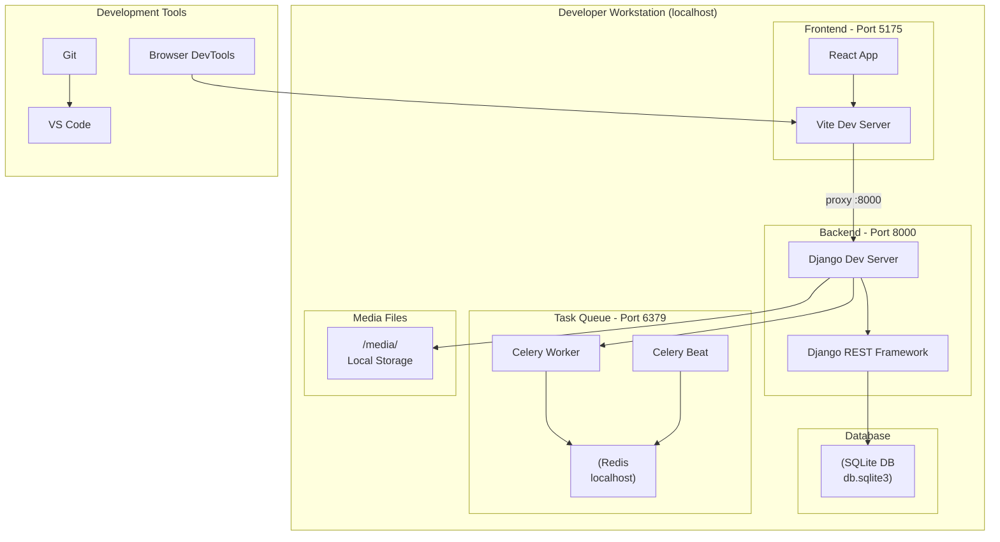
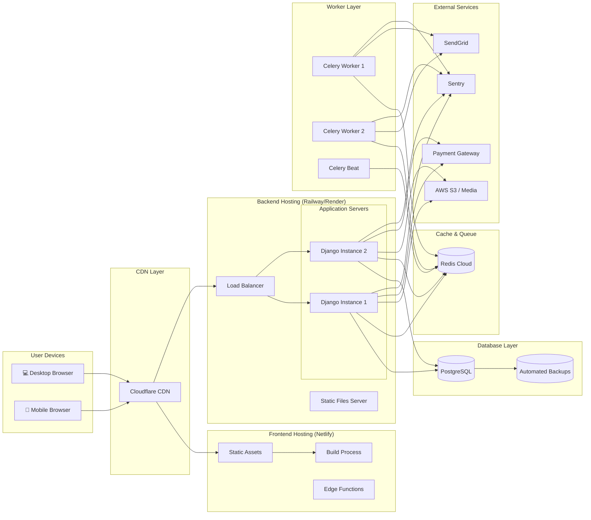
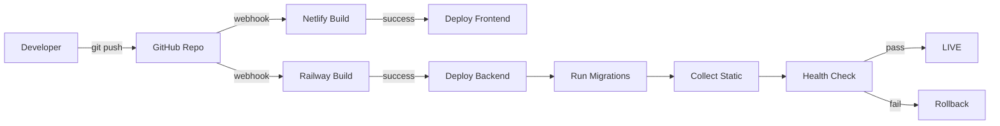

# 🚀 DIAGRAMA DE DESPLIEGUE - PREXCOL

**Proyecto**: PREXCOL  
**Fecha**: 2025-12-04  
**Tipo**: Diagrama Estructural - Infraestructura

---

## 📋 ÍNDICE

1. [Arquitectura de Despliegue](#arquitectura-de-despliegue)
2. [Entorno de Desarrollo](#entorno-de-desarrollo)
3. [Entorno de Producción](#entorno-de-producción)
4. [Especificaciones de Hardware](#especificaciones-de-hardware)

---

## 🏗️ ARQUITECTURA DE DESPLIEGUE


### Vista General del Sistema

```
┌──────────────────────────────────────────────────────────────────┐
│                        INTERNET                                  │
└────────────────────────────┬─────────────────────────────────────┘
                             │
                    ┌────────▼────────┐
                    │   Cloudflare    │
                    │   (DNS + CDN)   │
                    │   SSL/TLS       │
                    └────────┬────────┘
                             │
          ┌──────────────────┴──────────────────┐
          │                                     │
┌─────────▼─────────┐               ┌──────────▼──────────┐
│   Netlify         │               │   Railway/          │
│   (Frontend)      │               │   Render            │
│                   │               │   (Backend)         │
│ • React App       │               │                     │
│ • Static Hosting  │               │ • Django App        │
│ • Edge Functions  │               │ • Gunicorn          │
│ • Auto Deploy     │               │ • PostgreSQL        │
└───────────────────┘               └─────────┬───────────┘
                                              │
                                    ┌─────────▼─────────┐
                                    │   Redis Cloud     │
                                    │   (Cache/Queue)   │
                                    └───────────────────┘
```

---

## 💻 ENTORNO DE DESARROLLO

### Diagrama de Despliegue Local



### Especificación: Entorno Local

| Componente | Software | Puerto | Notas |
|------------|----------|--------|-------|
| **Frontend** | Vite 5.x | 5175 | Hot Module Replacement |
| **Backend** | Django 4.x | 8000 | Auto-reload enabled |
| **Database** | SQLite 3 | - | Archivo local |
| **Cache** | Redis 7.x | 6379 | Opcional en desarrollo |
| **Task Queue** | Celery 5.x | - | Opcional en desarrollo |
| **Email** | Console Backend | - | Imprime en consola |

### Comando de Inicio Local

```batch
# Windows
start_prexcol.bat

# Proceso:
1. Activa entorno virtual Python
2. Verifica dependencias backend
3. Inicia Django en :8000
4. Verifica dependencias frontend  
5. Inicia Vite en :5175
6. (Opcional) Inicia Redis
7. (Opcional) Inicia Celery
```

---

## ☁️ ENTORNO DE PRODUCCIÓN

### Arquitectura Cloud



### Especificación: Producción

#### Frontend (Netlify)

| Aspecto | Especificación |
|---------|----------------|
| **Hosting** | Netlify CDN Global |
| **Build** | Automatic on git push |
| **Framework** | React + Vite |
| **Deploy Time** | ~2-3 minutos |
| **SSL** | Auto-provisioned (Let's Encrypt) |
| **Domain** | Custom domain supported |
| **Environment** | Production environment variables |

```yaml
# netlify.toml
[build]
  command = "npm run build"
  publish = "dist"

[[redirects]]
  from = "/*"
  to = "/index.html"
  status = 200

[build.environment]
  NODE_VERSION = "20"
```

#### Backend (Railway/Render)

| Aspecto | Especificación |
|---------|----------------|
| **Hosting** | Railway/Render PaaS |
| **App Server** | Gunicorn (4 workers) |
| **Framework** | Django 4.x |
| **Database** | PostgreSQL 15 |
| **Redis** | Redis Cloud (Managed) |
| **Workers** | Celery (2 instances) |
| **Memory** | 1GB-2GB RAM |
| **CPU** | 1-2 vCPUs |

```python
# Production Settings
ALLOWED_HOSTS = [
    'api.prexcol.com',
    'prexcol-backend.railway.app'
]

DATABASES = {
    'default': {
        'ENGINE': 'django.db.backends.postgresql',
        'NAME': os.getenv('PGDATABASE'),
        'USER': os.getenv('PGUSER'),
        'PASSWORD': os.getenv('PGPASSWORD'),
        'HOST': os.getenv('PGHOST'),
        'PORT': os.getenv('PGPORT', 5432),
    }
}

# Celery Configuration
CELERY_BROKER_URL = os.getenv('REDIS_URL')
CELERY_RESULT_BACKEND = os.getenv('REDIS_URL')
```

---

## 🖥️ NODOS DE DESPLIEGUE

### Nodo: Cliente (Navegador)

```
┌─────────────────────────────┐
│   Cliente (Browser)         │
├─────────────────────────────┤
│ Hardware:                   │
│ • CPU: Any modern           │
│ • RAM: 2GB+                 │
│ • Storage: Minimal (cache)  │
│                             │
│ Software:                   │
│ • Chrome/Firefox/Safari     │
│ • JavaScript Enabled        │
│ • Cookies Enabled           │
│                             │
│ Components:                 │
│ • React App (SPA)           │
│ • Service Worker (PWA)      │
│ • Local Storage             │
└─────────────────────────────┘
```

### Nodo: Servidor Frontend (Netlify)

```
┌─────────────────────────────┐
│   Frontend Server           │
├─────────────────────────────┤
│ Infrastructure:             │
│ • Global CDN                │
│ • Edge Network              │
│ • Automatic Scaling         │
│                             │
│ Components:                 │
│ • Static File Server        │
│ • Edge Functions            │
│ • Build System              │
│                             │
│ Artifacts:                  │
│ • HTML/CSS/JS               │
│ • Images/Assets             │
│ • Service Worker            │
└─────────────────────────────┘
```

### Nodo: Servidor Backend (Railway/Render)

```
┌─────────────────────────────┐
│   Application Server        │
├─────────────────────────────┤
│ Infrastructure:             │
│ • 2GB RAM                   │
│ • 2 vCPU                    │
│ • 10GB SSD                  │
│                             │
│ Software Stack:             │
│ • Python 3.11               │
│ • Django 4.2                │
│ • Gunicorn WSGI             │
│ • NGINX (reverse proxy)     │
│                             │
│ Components:                 │
│ • Django Application        │
│ • REST API (DRF)            │
│ • Static Files (WhiteNoise) │
│ • Media Upload Handler      │
└─────────────────────────────┘
```

### Nodo: Base de Datos (PostgreSQL)

```
┌─────────────────────────────┐
│   Database Server           │
├─────────────────────────────┤
│ Infrastructure:             │
│ • 4GB RAM                   │
│ • 2 vCPU                    │
│ • 20GB SSD Storage          │
│                             │
│ Software:                   │
│ • PostgreSQL 15             │
│ • Automated Backups         │
│ • Point-in-time Recovery    │
│                             │
│ Configuration:              │
│ • max_connections: 100      │
│ • shared_buffers: 1GB       │
│ • Replication: Enabled      │
└─────────────────────────────┘
```

### Nodo: Cache/Queue (Redis)

```
┌─────────────────────────────┐
│   Redis Server              │
├─────────────────────────────┤
│ Infrastructure:             │
│ • 1GB RAM                   │
│ • 1 vCPU                    │
│ • Persistence Enabled       │
│                             │
│ Software:                   │
│ • Redis 7.x                 │
│ • AOF Persistence           │
│                             │
│ Usage:                      │
│ • Celery Broker             │
│ • Celery Results            │
│ • Session Cache             │
│ • API Response Cache        │
└─────────────────────────────┘
```

### Nodo: Workers (Celery)

```
┌─────────────────────────────┐
│   Celery Workers            │
├─────────────────────────────┤
│ Infrastructure:             │
│ • 512MB RAM each            │
│ • 0.5 vCPU each             │
│ • 2 Instances               │
│                             │
│ Tasks:                      │
│ • Send Emails               │
│ • Process Notifications     │
│ • Auto Stock Recharge       │
│ • Generate Reports          │
│                             │
│ Schedule:                   │
│ • Celery Beat               │
│ • Periodic Tasks            │
└─────────────────────────────┘
```

---

## 📊 ESPECIFICACIONES DE HARDWARE

### Desarrollo

| Recurso | Mínimo | Recomendado |
|---------|--------|-------------|
| **CPU** | 2 cores | 4 cores |
| **RAM** | 4GB | 8GB |
| **Disco** | 10GB | 20GB SSD |
| **SO** | Windows 10 | Windows 11 |
| **Python** | 3.9+ | 3.11+ |
| **Node.js** | 18.x | 20.x |

### Producción - Tier Starter

| Servicio | Specs | Costo Aprox. |
|----------|-------|--------------|
| **Netlify (Frontend)** | CDN Global, 100GB bandwidth | $0 - $19/mes |
| **Railway (Backend)** | 2GB RAM, 2 vCPU, 10GB disk | $5 - $20/mes |
| **PostgreSQL** | 1GB RAM, 10GB storage | $7 - $15/mes |
| **Redis Cloud** | 30MB RAM | $0 - $10/mes |
| **Total** | - | **$12 - $64/mes** |

### Producción - Tier Professional

| Servicio | Specs | Costo Aprox. |
|----------|-------|--------------|
| **Netlify Pro** | CDN, 1TB bandwidth | $19/mes |
| **Railway Pro** | 8GB RAM, 4 vCPU, 50GB disk | $50/mes |
| **PostgreSQL** | 4GB RAM, 50GB storage | $50/mes |
| **Redis Cloud** | 1GB RAM | $15/mes |
| **Cloudinary** | 25GB storage, 25GB bandwidth | $99/mes |
| **SendGrid** | 100K emails/mes | $19.95/mes |
| **Total** | - | **$252.95/mes** |

---

## 🔒 SEGURIDAD EN DESPLIEGUE

### SSL/TLS

```
┌─────────────────────────────────────────┐
│          SSL Certificate                │
├─────────────────────────────────────────┤
│ • Auto-provisioned (Let's Encrypt)      │
│ • Auto-renewal                          │
│ • TLS 1.3 Support                       │
│ • HSTS Enabled                          │
│ • Perfect Forward Secrecy               │
└─────────────────────────────────────────┘
```

### Firewall Rules

```
Frontend (Netlify):
• Allow: HTTPS (443)
• Block: All other ports

Backend (Railway):
• Allow: HTTPS (443) from Frontend
• Allow: PostgreSQL (5432) from App only
• Block: Direct DB access from internet

Database (PostgreSQL):
• Allow: Connections only from Backend IPs
• Require: SSL connections
• Block: Public access
```

### Environment Variables

```bash
# Production .env
SECRET_KEY=<django-secret-key>
DATABASE_URL=<postgres-connection-string>
REDIS_URL=<redis-connection-string>
ALLOWED_HOSTS=api.prexcol.com,prexcol.netlify.app

# Email
EMAIL_HOST=smtp.sendgrid.net
EMAIL_HOST_USER=apikey
EMAIL_HOST_PASSWORD=<sendgrid-api-key>

# Storage
AWS_ACCESS_KEY_ID=<aws-key>
AWS_SECRET_ACCESS_KEY=<aws-secret>
AWS_STORAGE_BUCKET_NAME=prexcol-media
AWS_S3_REGION_NAME=us-east-1

# Monitoring
SENTRY_DSN=<sentry-dsn>
```

---

## 🚀 PROCESO DE DESPLIEGUE

### Pipeline CI/CD



### Comandos de Despliegue

#### Frontend (Netlify)

```bash
# Build local
npm run build

# Deploy manual (CLI)
netlify deploy --prod

# Auto deploy triggers on:
# - Push to main branch
# - Pull request merge
```

#### Backend (Railway)

```bash
# Build command
pip install -r requirements.txt

# Start command
gunicorn backend.wsgi:application --bind 0.0.0.0:$PORT

# Migraciones
python manage.py migrate

# Collect static
python manage.py collectstatic --noinput
```

---

## 📈 ESCALABILIDAD

### Horizontal Scaling

```
Load Balancer
    │
    ├─── App Instance 1 (1GB RAM)
    ├─── App Instance 2 (1GB RAM)
    ├─── App Instance 3 (1GB RAM)
    └─── App Instance N...

• Auto-scaling based on CPU/Memory
• Min instances: 2
• Max instances: 10
• Scale up threshold: >70% CPU
• Scale down threshold: <30% CPU
```

### Vertical Scaling

```
Tier 1 (Starter):
• 1GB RAM, 1 vCPU
• ~100 concurrent users

Tier 2 (Professional):
• 4GB RAM, 2 vCPU
• ~500 concurrent users

Tier 3 (Business):
• 8GB RAM, 4 vCPU
• ~2000 concurrent users
```

---

## 🔍 MONITOREO

### Métricas Clave

```
Application Metrics:
• Request/Response Time
• Error Rate (4xx, 5xx)
• Throughput (req/sec)
• Active Users

Infrastructure Metrics:
• CPU Usage (%)
• Memory Usage (%)
• Disk I/O
• Network I/O

Database Metrics:
• Query Performance
• Connections Count
• Slow Queries
• Deadlocks
```

### Herramientas de Monitoreo

| Herramienta | Propósito |
|-------------|-----------|
| **Sentry** | Error Tracking & Performance |
| **Railway Metrics** | Infrastructure Monitoring |
| **PostgreSQL Logs** | Database Performance |
| **Netlify Analytics** | Frontend Analytics |

---

**Documento generado**: 2025-12-04  
**Versión**: 1.0  
**Estado**: ✅ Completado
