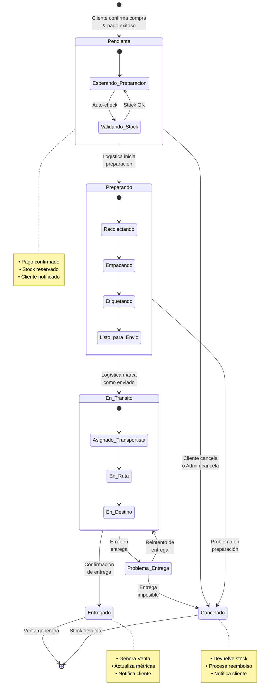
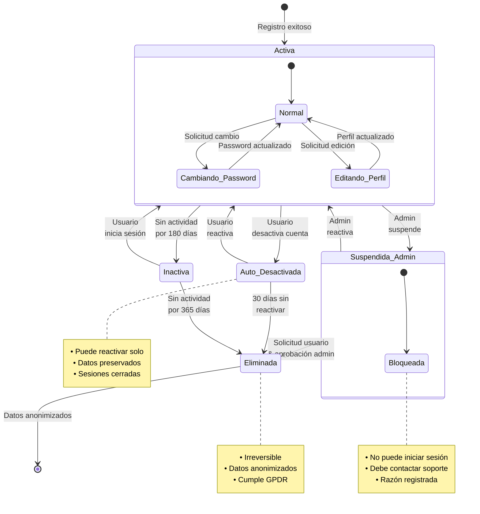
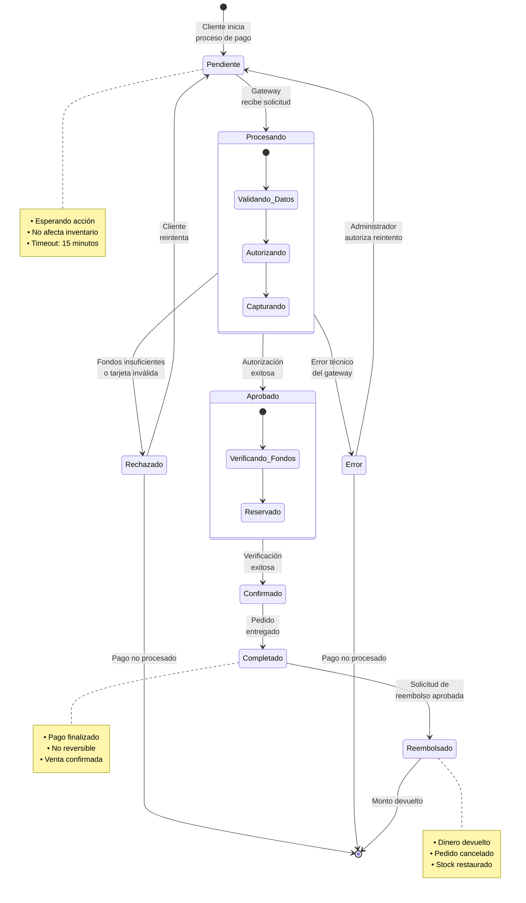
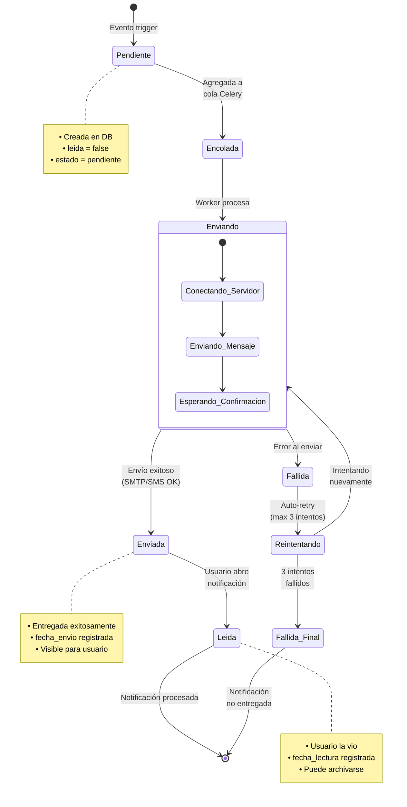
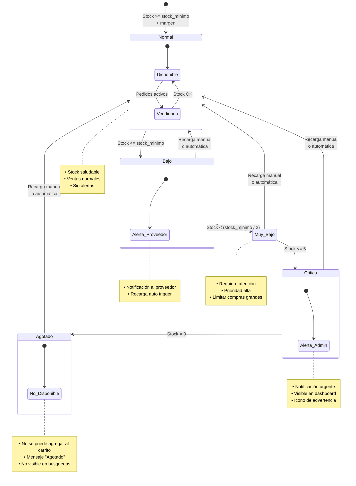

# ⚙️ DIAGRAMAS DE MÁQUINAS DE ESTADO - PREXCOL

**Proyecto**: PREXCOL  
**Fecha**: 2025-12-04  
**Tipo**: Diagramas de Comportamiento - Estados y Transiciones

---

## 📋 ÍNDICE

1. [Estado del Pedido](#estado-del-pedido)
2. [Estado de la Cuenta de Usuario](#estado-de-la-cuenta-de-usuario)
3. [Estado del Pago](#estado-del-pago)
4. [Estado de la Notificación](#estado-de-la-notificación)
5. [Estado del Stock](#estado-del-stock)

---

## 📦 ESTADO DEL PEDIDO


### Diagrama de Estados



### Tabla de Transiciones

| Estado Origen | Evento | Acción | Estado Destino | Actor |
|---------------|--------|--------|----------------|-------|
| - | Pago exitoso | Crear pedido, reservar stock | Pendiente | Sistema |
| Pendiente | Iniciar preparación | Asignar a logística | Preparando | Logística |
| Pendiente | Cancelar | Devolver stock | Cancelado | Cliente/Admin |
| Preparando | Marcar enviado | Asignar transportista | En_Transito | Logística |
| Preparando | Reportar problema | Notificar admin | Cancelado | Logística |
| En_Transito | Confirmar entrega | Generar venta | Entregado | Logística/Sistema |
| En_Transito | Problema entrega | Registrar incidente | Problema_Entrega | Logística |
| Problema_Entrega | Reintentar | Reprogramar entrega | En_Transito | Logística |
| Problema_Entrega | Imposible entregar | Procesar reembolso | Cancelado | Admin |

### Invariantes de Estado

```python
# Reglas de Negocio por Estado

Estado.PENDIENTE:
    - Pago debe estar APROBADO
    - Stock debe estar reservado
    - No puede tener detalles vacíos
    - Total debe ser > 0

Estado.PREPARANDO:
    - Debe tener logística asignada
    - Todos los productos deben existir
    - Stock debe seguir disponible

Estado.EN_TRANSITO:
    - Debe tener transportista asignado
    - Fecha de envío registrada
    - Tracking ID (opcional)

Estado.ENTREGADO:
    - Debe tener confirmación de entrega
    - Venta debe estar generada
    - Cliente notificado

Estado.CANCELADO:
    - Debe tener razón de cancelación
    - Stock debe estar devuelto
    - Reembolso procesado (si aplica)
```

---

## 👤 ESTADO DE LA CUENTA DE USUARIO

### Diagrama de Estados



### Tabla de Transiciones

| Estado Origen | Evento | Acción | Estado Destino | Actor |
|---------------|--------|--------|----------------|-------|
| - | Registro | Crear usuario, enviar email | Activa | Sistema |
| Activa | Desactivar cuenta | Cerrar sesiones | Auto_Desactivada | Usuario |
| Activa | Suspender | Bloquear acceso, notificar | Suspendida_Admin | Admin |
| Activa | Sin actividad 180 días | Marcar inactiva | Inactiva | Sistema |
| Auto_Desactivada | Reactivar | Restaurar acceso | Activa | Usuario |
| Auto_Desactivada | 30 días sin usar | Anonimizar datos | Eliminada | Sistema |
| Suspendida_Admin | Reactivar | Desbloquear | Activa | Admin |
| Suspendida_Admin | Solicitar eliminación | Anonimizar | Eliminada | Admin |
| Inactiva | Login | Actualizar last_activity | Activa | Usuario |
| Inactiva | 365 días sin usar | Anonimizar | Eliminada | Sistema |

### Permisos por Estado

```python
# Matriz de Permisos

Estado.ACTIVA:
    - Puede iniciar sesión: SÍ
    - Puede realizar operaciones: SÍ
    - Visible en sistema: SÍ
    - Recibe notificaciones: SÍ

Estado.AUTO_DESACTIVADA:
    - Puede iniciar sesión: SÍ (para reactivar)
    - Puede realizar operaciones: NO
    - Visible en sistema: NO
    - Recibe notificaciones: NO

Estado.SUSPENDIDA_ADMIN:
    - Puede iniciar sesión: NO
    - Puede realizar operaciones: NO
    - Visible en sistema: SÍ (para admin)
    - Recibe notificaciones: NO

Estado.INACTIVA:
    - Puede iniciar sesión: SÍ (reactiva automáticamente)
    - Puede realizar operaciones: Limitadas
    - Visible en sistema: NO
    - Recibe notificaciones: NO

Estado.ELIMINADA:
    - Puede iniciar sesión: NO
    - Puede realizar operaciones: NO
    - Visible en sistema: NO
    - Recibe notificaciones: NO
```

---

## 💳 ESTADO DEL PAGO

### Diagrama de Estados



### Tabla de Transiciones

| Estado Origen | Evento | Acción | Estado Destino | Actor |
|---------------|--------|--------|----------------|-------|
| - | Iniciar pago | Crear registro | Pendiente | Cliente |
| Pendiente | Enviar a gateway | Conectar gateway | Procesando | Sistema |
| Procesando | Autorización OK | Guardar referencia | Aprobado | Gateway |
| Procesando | Autorización denegada | Registrar razón | Rechazado | Gateway |
| Procesando | Error técnico | Log error | Error | Gateway |
| Rechazado | Reintentar | Limpiar datos | Pendiente | Cliente |
| Error | Autorizar reintento | Resetear | Pendiente | Admin |
| Aprobado | Verificar fondos | Reservar monto | Confirmado | Sistema |
| Confirmado | Pedido entregado | Capturar pago | Completado | Sistema |
| Completado | Solicitar reembolso | Procesar devolución | Reembolsado | Admin |

---

## 📧 ESTADO DE LA NOTIFICACIÓN

### Diagrama de Estados



### Tabla de Transiciones

| Estado Origen | Evento | Acción | Estado Destino | Actor |
|---------------|--------|--------|----------------|-------|
| - | Evento ocurre | Crear notificación | Pendiente | Sistema |
| Pendiente | Encolar tarea | Enviar a Redis | Encolada | Sistema |
| Encolada | Worker toma tarea | Procesar envío | Enviando | Celery |
| Enviando | SMTP/SMS OK | Registrar envío | Enviada | Sistema |
| Enviando | SMTP/SMS fail | Log error | Fallida | Sistema |
| Fallida | Auto-retry | Reencolar | Reintentando | Celery |
| Reintentando | Procesar | Intentar envío | Enviando | Celery |
| Reintentando | 3 fallos | Marcar como final | Fallida_Final | Sistema |
| Enviada | Usuario abre | Actualizar timestamp | Leida | Usuario |

---

## 📊 ESTADO DEL STOCK

### Diagrama de Estados



### Tabla de Transiciones

| Estado Origen | Evento | Acción | Estado Destino |
|---------------|--------|--------|----------------|
| Normal | stock <= stock_minimo | Notificar proveedor, trigger recarga auto | Bajo |
| Bajo | stock < (stock_minimo / 2) | Alerta urgente, priorizar recarga | Muy_Bajo |
| Muy_Bajo | stock <= 5 | Alerta crítica admin, limitar ventas | Critico |
| Critico | stock = 0 | Ocultar producto, desactivar ventas | Agotado |
| Bajo/Muy_Bajo/Critico/Agotado | Recarga | Aumentar stock, cancelar alertas | Normal |

### Acciones por Estado

```python
# Comportamiento del Sistema por Estado

Estado.NORMAL:
    - Visible en catálogo: SÍ
    - Permite compra: SÍ
    - Límite de compra: Sin límite
    - Alertas: NO
    - Recarga automática: NO

Estado.BAJO:
    - Visible en catálogo: SÍ
    - Permite compra: SÍ
    - Límite de compra: Normal
    - Alertas: Proveedor notificado
    - Recarga automática: SÍ (si activa)

Estado.MUY_BAJO:
    - Visible en catálogo: SÍ
    - Permite compra: SÍ
    - Límite de compra: Max 3 unidades
    - Alertas: Proveedor + Admin
    - Recarga automática: SÍ (prioridad alta)

Estado.CRITICO:
    - Visible en catálogo: SÍ (con advertencia)
    - Permite compra: SÍ
    - Límite de compra: Max 1 unidad
    - Alertas: Urgente a Admin
    - Recarga automática: SÍ (prioridad máxima)

Estado.AGOTADO:
    - Visible en catálogo: NO (o con "Agotado")
    - Permite compra: NO
    - Límite de compra: 0
    - Alertas: Admin notificado
    - Recarga automática: Esperando recarga
```

---

## 🔗 INTERACCIONES ENTRE MÁQUINAS DE ESTADO

### Pedido ↔ Pago

```
Pago:APROBADO → Pedido:PENDIENTE
Pedido:CANCELADO → Pago:REEMBOLSADO
Pedido:ENTREGADO → Pago:COMPLETADO
```

### Pedido ↔ Stock

```
Pedido:PENDIENTE → Stock: reducir cantidad
Pedido:CANCELADO → Stock: devolver cantidad
Stock:AGOTADO → Pedido: no permitir crear
```

### Usuario ↔ Pedido

```
Usuario:SUSPENDIDA_ADMIN → Pedidos: cancelar pendientes
Usuario:AUTO_DESACTIVADA → Pedidos: mantener histórico
Usuario:ELIMINADA → Pedidos: anonimizar cliente
```

### Stock ↔ Notificación

```
Stock:BAJO → Notificación:PENDIENTE (tipo: stock_bajo)
Stock:CRITICO → Notificación:PENDIENTE (tipo: stock_critico)
Stock:AGOTADO → Notificación:PENDIENTE (tipo: agotado)
```

---

## 📊 RESUMEN DE ESTADOS POR ENTIDAD

| Entidad | Estados Posibles | Estado Inicial | Estados Finales |
|---------|------------------|----------------|-----------------|
| **Pedido** | Pendiente, Preparando, En_Transito, Problema_Entrega, Entregado, Cancelado | Pendiente | Entregado, Cancelado |
| **Usuario** | Activa, Auto_Desactivada, Suspendida_Admin, Inactiva, Eliminada | Activa | Eliminada |
| **Pago** | Pendiente, Procesando, Aprobado, Confirmado, Completado, Rechazado, Error, Reembolsado | Pendiente | Completado, Rechazado, Reembolsado, Error |
| **Notificación** | Pendiente, Encolada, Enviando, Enviada, Leida, Fallida, Reintentando, Fallida_Final | Pendiente | Leida, Fallida_Final |
| **Stock** | Normal, Bajo, Muy_Bajo, Critico, Agotado | Normal | - (cíclico) |

---

**Documento generado**: 2025-12-04  
**Versión**: 1.0  
**Estado**: ✅ Completado
