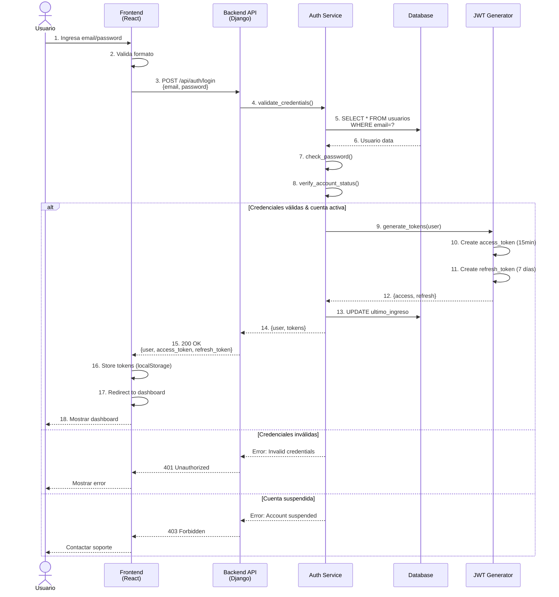
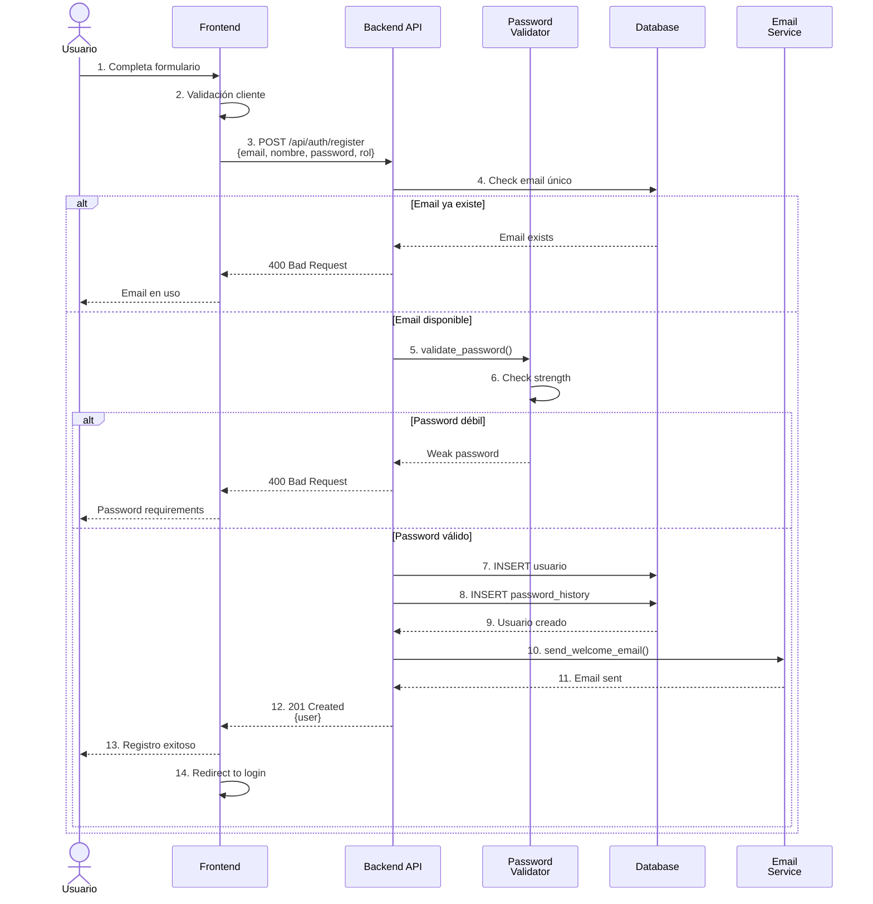
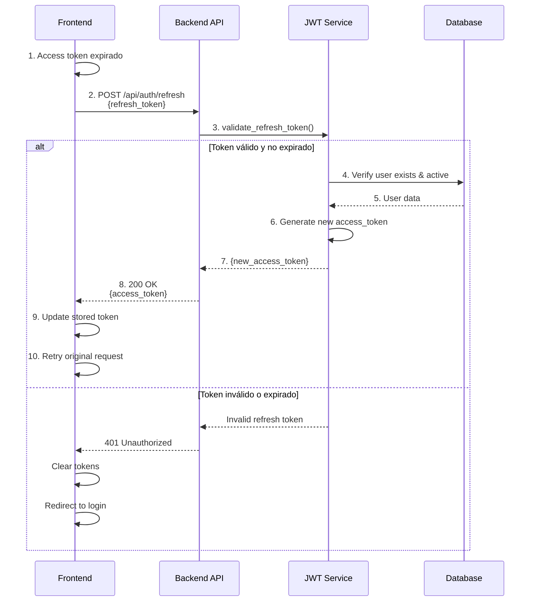
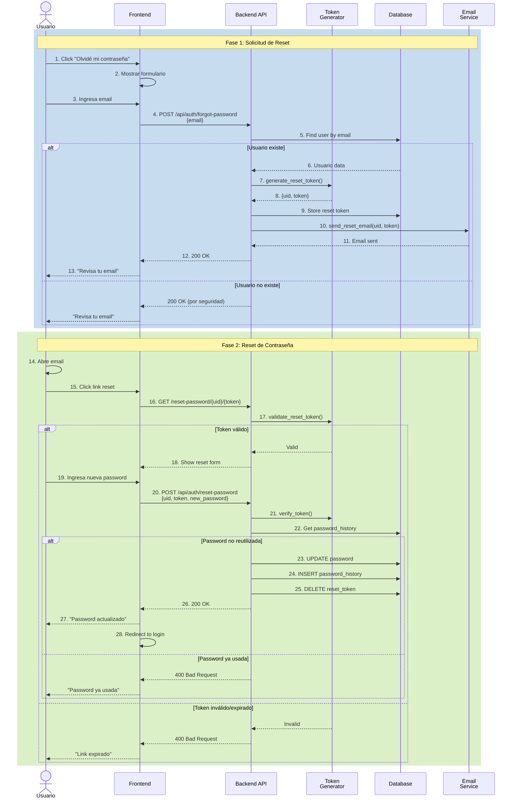
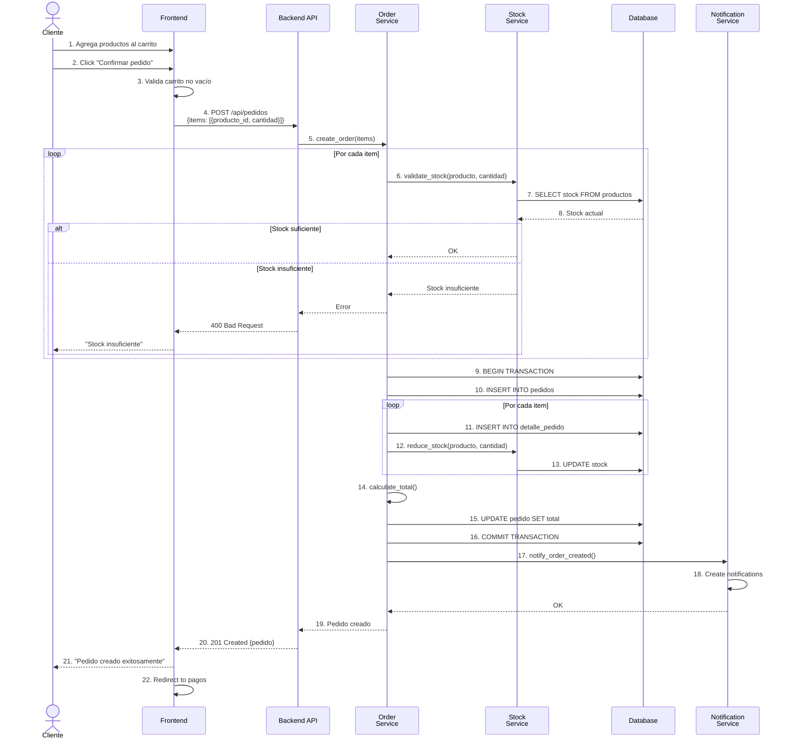
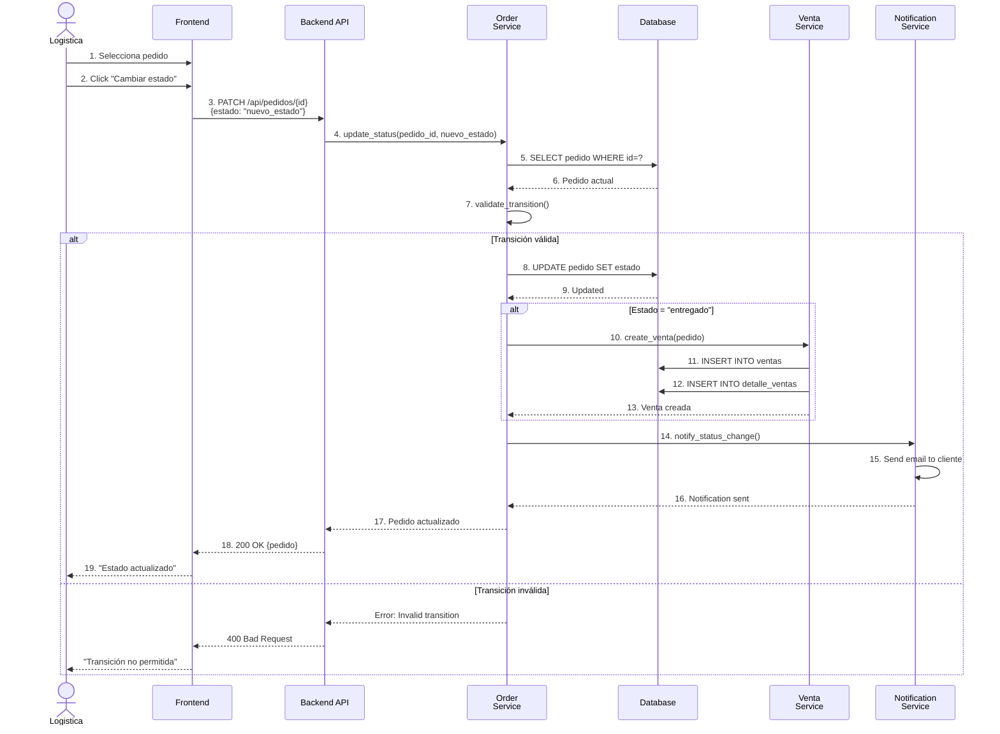
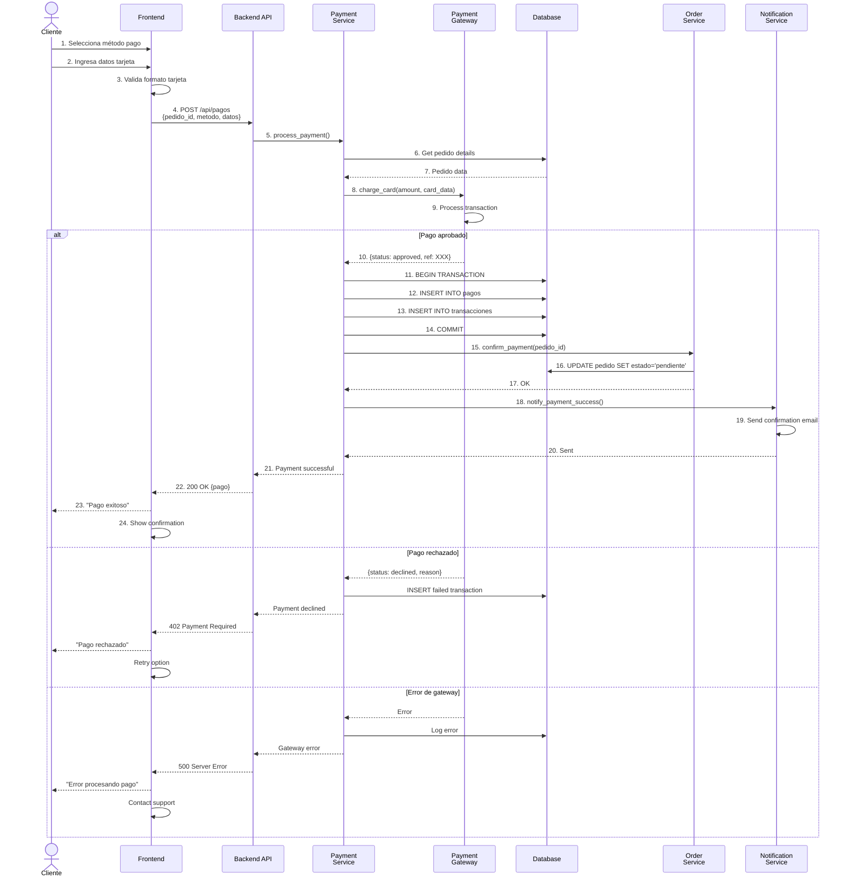
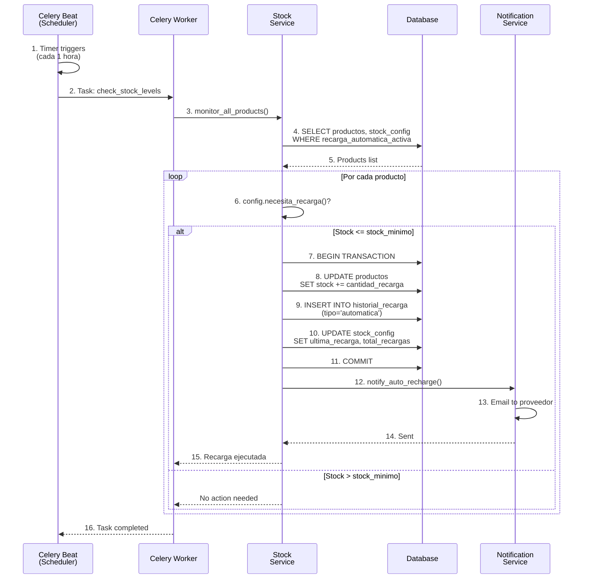
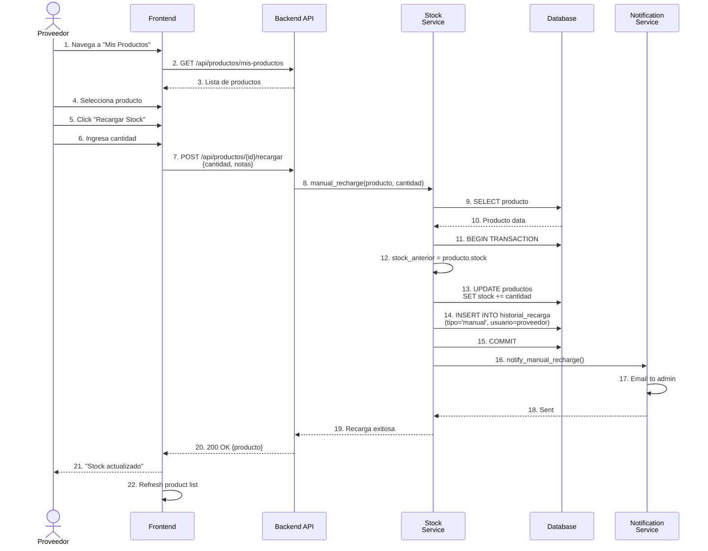
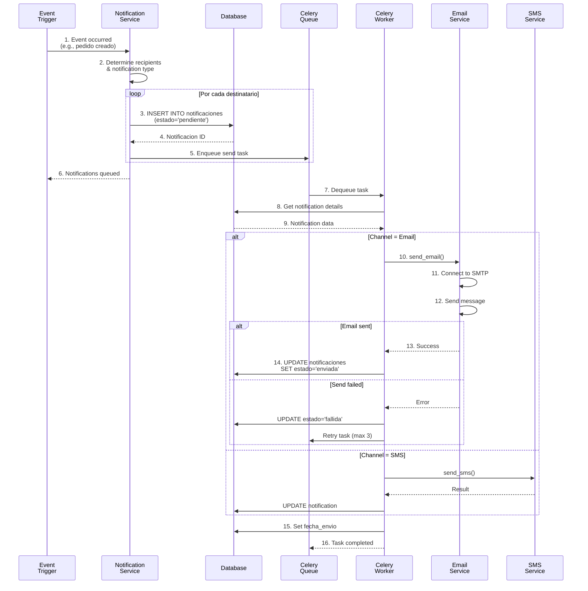

# 🔄 DIAGRAMAS DE SECUENCIA - PREXCOL

**Proyecto**: PREXCOL  
**Fecha**: 2025-12-04  
**Tipo**: Diagramas de Comportamiento - Interacción

---

## 📋 ÍNDICE

1. [Autenticación](#autenticación)
2. [Gestión de Pedidos](#gestión-de-pedidos)
3. [Procesar Pago](#procesar-pago)
4. [Recarga de Stock](#recarga-de-stock)
5. [Notificaciones](#notificaciones)

---

## 🔐 AUTENTICACIÓN

### Secuencia: Login de Usuario

### Secuencia: Registro de Usuario

### Secuencia: Refresh Token

### Secuencia: Reset Password

---

## 🛒 GESTIÓN DE PEDIDOS

### Secuencia: Crear Pedido

### Secuencia: Cambiar Estado de Pedido

---

## 💳 PROCESAR PAGO

### Secuencia: Pago con Tarjeta

---

## 📦 RECARGA DE STOCK

### Secuencia: Recarga Automática

### Secuencia: Recarga Manual

---

## 📧 NOTIFICACIONES

### Secuencia: Envío de Notificación

---

**Documento generado**: 2025-12-04  
**Versión**: 1.0  
**Estado**: ✅ Completado
