# 🔄 Diagramas de Flujo de Aprendizaje - PREXCOL

> Diagramas visuales para entender cómo fluye el código en diferentes escenarios

---

## 📊 DIAGRAMA 1: Flujo de Autenticación


### Archivos involucrados:
1. **Frontend**: `pages/Login.jsx` → `services/authService.js` → `context/AuthContext.jsx`
2. **Backend**: `apps/usuarios/views.py` → `apps/usuarios/serializers.py`

---

## 📊 DIAGRAMA 2: Flujo de Creación de Producto


### Archivos involucrados:
1. **Frontend**: `pages/admin/AdminProducts.jsx` → `services/productService.js`
2. **Backend**: `apps/productos/views.py` → `apps/productos/serializers.py` → `apps/productos/models.py`

---

## 📊 DIAGRAMA 3: Flujo de Compra Completa


### Archivos involucrados:
1. **Frontend**: 
   - `pages/ProductList.jsx` 
   - `pages/ProductDetail.jsx`
   - `context/CartContext.jsx`
   - `pages/Cart.jsx`
   - `pages/Checkout.jsx`
   - `services/orderService.js`

2. **Backend**: 
   - `apps/ventas/views.py`
   - `apps/ventas/serializers.py`
   - `apps/detalles_pedido/models.py`
   - `apps/productos/models.py`
   - `apps/notificaciones/signals.py`

---

## 📊 DIAGRAMA 4: Flujo de Carga de Datos en Lista

```mermaid
graph TD
    A[Componente monta] -->|useEffect ejecuta| B[productService.getAll]
    B -->|GET /api/productos/?page=1| C[Backend: ProductoViewSet.list]
    C -->|Aplica filtros| D[Queryset filtrado]
    D -->|Aplica paginación| E[Pagina resultados]
    E -->|Serializa datos| F[ProductoSerializer.many=True]
    F -->|Retorna JSON| G[Frontend recibe data]
    G -->|Actualiza estado| H[useState setProducts]
    H -->|Re-renderiza| I[Muestra lista]
    I -->|Usuario cambia página| B
    
    style A fill:#e1f5ff
    style C fill:#fff4e1
    style H fill:#e8f5e9
```



### Archivos involucrados:
1. **Frontend**: `pages/ProductList.jsx` → `services/productService.js`
2. **Backend**: `apps/productos/views.py` → `apps/productos/serializers.py` → `pagination.py`

---

## 📊 DIAGRAMA 5: Flujo de Actualización en Tiempo Real

```mermaid
graph TD
    A[Usuario realiza acción] -->|Trigger| B[Backend crea Notificacion]
    B -->|Signal post_save| C[NotificationSignal]
    C -->|Guarda en BD| D[Notificacion.objects.create]
    D -->|WebSocket/Polling| E[Frontend polling]
    E -->|GET /api/notificaciones/| F[Backend retorna nuevas]
    F -->|Actualiza estado| G[NotificationContext]
    G -->|Muestra badge| H[NotificationBell.jsx]
    H -->|Usuario click| I[NotificationList.jsx]
    I -->|Marca como leída| J[PATCH /api/notificaciones/{id}/]
    
    style B fill:#fff4e1
    style D fill:#e8f5e9
    style G fill:#e1f5ff
```

### Archivos involucrados:
1. **Backend**: 
   - `apps/notificaciones/models.py`
   - `apps/notificaciones/signals.py`
   - `apps/notificaciones/views.py`

2. **Frontend**: 
   - `context/NotificationContext.jsx`
   - `components/NotificationBell.jsx`
   - `components/NotificationList.jsx`

---

## 📊 DIAGRAMA 6: Flujo de Validación de Formulario

```mermaid
graph TD
    A[Usuario escribe en input] -->|onChange| B[Actualiza estado local]
    B -->|onBlur| C[Valida campo]
    C -->|validators.js| D{¿Válido?}
    D -->|Sí| E[Limpia error]
    D -->|No| F[Muestra error]
    F -->|Renderiza| G[Mensaje de error]
    E -->|Usuario envía form| H[Valida todo el form]
    H -->|Todos válidos| I[Envía a backend]
    I -->|Backend valida| J{¿Válido?}
    J -->|Sí| K[Guarda en BD]
    J -->|No| L[Retorna errores]
    L -->|Muestra errores| A
    
    style C fill:#e1f5ff
    style I fill:#fff4e1
    style K fill:#e8f5e9
    style L fill:#ffebee
```



### Archivos involucrados:
1. **Frontend**: 
   - `components/FormInput.jsx`
   - `utils/validators.js`
   - `pages/Register.jsx` (ejemplo)

2. **Backend**: 
   - `apps/usuarios/serializers.py` (validaciones)

---

## 📊 DIAGRAMA 7: Flujo de Manejo de Errores

```mermaid
graph TD
    A[Request a API] -->|axios.post| B[Interceptor request]
    B -->|Agrega token| C[Envía request]
    C -->|Respuesta| D{¿Status?}
    D -->|200-299| E[Interceptor response]
    E -->|Retorna data| F[Componente recibe data]
    D -->|401| G[Token inválido]
    G -->|Logout| H[Redirige a login]
    D -->|400| I[Error de validación]
    I -->|Muestra errores| J[Componente muestra]
    D -->|500| K[Error de servidor]
    K -->|Muestra mensaje| L[Toast/Alert]
    
    style C fill:#e1f5ff
    style E fill:#e8f5e9
    style G fill:#ffebee
    style K fill:#ffebee
```



### Archivos involucrados:
1. **Frontend**: 
   - `config/axios.config.js`
   - `services/api.js`
   - `context/AuthContext.jsx`

---

## 📊 DIAGRAMA 8: Flujo de Permisos y Autorización

```mermaid
graph TD
    A[Request con token] -->|Headers| B[Backend recibe]
    B -->|Middleware| C[Valida token JWT]
    C -->|Extrae user| D[request.user]
    D -->|ViewSet| E[Verifica permission_classes]
    E -->|IsAuthenticated| F{¿Autenticado?}
    F -->|No| G[Error 401]
    F -->|Sí| H[Verifica permisos custom]
    H -->|IsAdminUser| I{¿Es admin?}
    I -->|No| J[Error 403]
    I -->|Sí| K[Ejecuta acción]
    K -->|Retorna data| L[Response]
    
    style B fill:#fff4e1
    style F fill:#e1f5ff
    style I fill:#e1f5ff
    style K fill:#e8f5e9
    style G fill:#ffebee
    style J fill:#ffebee
```



### Archivos involucrados:
1. **Backend**: 
   - `middleware/auth.py`
   - `apps/usuarios/permissions.py`
   - `apps/*/views.py` (permission_classes)

---

## 📊 DIAGRAMA 9: Flujo de Estado Global (Context)


### Archivos involucrados:
1. **Frontend**: 
   - `context/AuthContext.jsx`
   - `hooks/useAuth.js`
   - `App.jsx`
   - Cualquier componente que use `useAuth()`

---

## 📊 DIAGRAMA 10: Flujo de Routing

```mermaid
graph TD
    A[Usuario navega a /login] -->|BrowserRouter| B[AppRoutes.jsx]
    B -->|Matchea ruta| C{¿Ruta existe?}
    C -->|No| D[NotFound.jsx]
    C -->|Sí| E{¿Requiere auth?}
    E -->|No| F[Renderiza página pública]
    E -->|Sí| G[ProtectedRoute]
    G -->|Verifica token| H{¿Autenticado?}
    H -->|No| I[Redirect a /login]
    H -->|Sí| J{¿Tiene permiso?}
    J -->|No| K[Redirect a /unauthorized]
    J -->|Sí| L[Renderiza página]
    
    style B fill:#e1f5ff
    style G fill:#fff4e1
    style L fill:#e8f5e9
    style D fill:#ffebee
    style I fill:#ffebee
```



### Archivos involucrados:
1. **Frontend**: 
   - `routes/AppRoutes.jsx`
   - `routes/ProtectedRoute.jsx`
   - `App.jsx`

---

## 🎯 CÓMO USAR ESTOS DIAGRAMAS

### Para Aprender:
1. **Elige un flujo** que quieras entender
2. **Sigue el diagrama** paso a paso
3. **Abre los archivos** mencionados
4. **Lee el código** en el orden del flujo
5. **Prueba en la app** para ver el flujo en acción

### Para Debuggear:
1. **Identifica dónde falla** el flujo
2. **Ubica el paso** en el diagrama
3. **Revisa el archivo** correspondiente
4. **Agrega console.log** o breakpoints
5. **Sigue el flujo** hasta encontrar el error

### Para Desarrollar:
1. **Diseña el flujo** de tu nueva feature
2. **Identifica archivos** a modificar/crear
3. **Sigue patrones** de flujos similares
4. **Implementa paso a paso** siguiendo el diagrama
5. **Prueba cada paso** antes de continuar

---

## 📚 RECURSOS RELACIONADOS

- [Guía de Aprendizaje Completa](GUIA_APRENDIZAJE_CODIGO_COMPLETA.md)
- [Mapa de Archivos por Tema](MAPA_ARCHIVOS_POR_TEMA.md)
- [Arquitectura del Sistema](../arquitectura.rst)

---

**Estos diagramas son tu mapa para navegar el código. ¡Úsalos! 🗺️**
