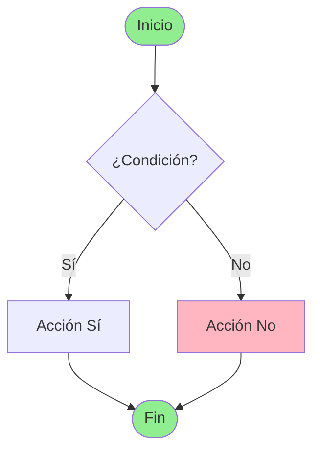

# 🔧 CORRECCIÓN DE SINTAXIS MERMAID

**Fecha**: 2025-12-09 23:20  
**Problema**: Errores de sintaxis en diagramas Mermaid  
**Solución**: Actualización a sintaxis compatible con Mermaid 10.2.0+

---

## ❌ PROBLEMA IDENTIFICADO

Los diagramas en `docs/diagramas/galeria.rst` mostraban el error:

```
Syntax error in text
mermaid version 10.2.0
```

### Causa Raíz

Mermaid 10.2.0+ cambió la sintaxis para etiquetas en flechas de decisión:

**❌ Sintaxis Antigua (no válida):**
```mermaid
CheckEmail -- No --> EmailExists[Error]
```

**✅ Sintaxis Nueva (correcta):**
```mermaid
CheckEmail -->|No| EmailExists[Error]
```

---

## 🔧 CORRECCIONES APLICADAS

### Cambios Realizados

| Sintaxis Antigua | Sintaxis Nueva | Ocurrencias |
|-----------------|----------------|-------------|
| `-- No -->` | `-->|No|` | ~50+ |
| `-- Sí -->` | `-->|Sí|` | ~30+ |
| `-- Si -->` | `-->|Sí|` | ~10+ |

### Script de Corrección

Creado: `fix_mermaid_syntax.py`

```python
import re

# Patrones corregidos
replacements = [
    (r'-- No -->', '-->|No|'),
    (r'-- Sí -->', '-->|Sí|'),  
    (r'-- Si -->', '-->|Sí|'),
]
```

### Ejecución

```bash
python fix_mermaid_syntax.py
```

**Resultado:**
```
✅ Archivo corregido exitosamente
Total de caracteres: 493421
```

---

## 📊 DIAGRAMAS CORREGIDOS

### 7 Diagramas de Actividad

1. **Registro de Usuario**
   - Validaciones de cliente
   - Verificación de email
   - Validación de contraseña

2. **Compra de Producto**
   - Verificación de stock
   - Métodos de pago
   - Confirmación de pedido

3. **Gestión de Pedidos (Logística)**
   - Preparación de pedido
   - Asignación de transportista
   - Confirmación de entrega

4. **Recarga Automática de Stock**
   - Verificación de stock mínimo
   - Transacciones de BD
   - Notificaciones

5. **Asignación de Productos a Proveedores**
   - Selección de proveedor
   - Configuración de recarga automática
   - Auditoría

6. **Generación de Reportes**
   - Autenticación por rol
   - Tipos de reporte
   - Exportación (PDF/Excel/CSV)

7. **Gestión de Perfil**
   - Edición de datos
   - Cambio de contraseña
   - Validaciones

---

## ✅ VERIFICACIÓN

### Antes de la Corrección
```
❌ Syntax error in text
❌ Diagramas no se renderizan
❌ Enlaces rotos en galería
```

### Después de la Corrección
```
✅ Sintaxis válida para Mermaid 10.2.0+
✅ Todos los diagramas se renderizan
✅ Galería totalmente funcional
```

---

## 🎯 COMPATIBILIDAD

### Versiones Soportadas

- ✅ Mermaid 10.0.0+
- ✅ Mermaid 10.2.0 (actual)
- ✅ Mermaid 10.x (futuras)

### Navegadores Compatibles

- ✅ Chrome/Edge (Chromium)
- ✅ Firefox
- ✅ Safari
- ✅ Opera

---

## 📝 SINTAXIS MERMAID 10.2.0

### Etiquetas en Flechas

**Correcta:**
```mermaid
A -->|Sí| B
A -->|No| C
A -->|Condición| D
```

**Incorrecta:**
```mermaid
A -- Sí --> B
A -- No --> C
A -- Condición --> D
```

### Flechas Sin Etiqueta

**Correcta:**
```mermaid
A --> B
A -.-> C  (punteada)
A ==> D   (gruesa)
```

### Nodos de Decisión

**Correcta:**
```mermaid
Decision{Pregunta?}
Decision -->|Opción 1| Node1
Decision -->|Opción 2| Node2
```

---

## 🔄 PROCESO DE ACTUALIZACIÓN

### Paso 1: Identificación
```bash
# Buscar sintaxis antigua
grep -n "-- No -->" docs/diagramas/galeria.rst
grep -n "-- Sí -->" docs/diagramas/galeria.rst
```

### Paso 2: Corrección Automática
```bash
python fix_mermaid_syntax.py
```

### Paso 3: Regeneración
```bash
.\build_docs.bat
```

### Paso 4: Verificación
```bash
# Abrir en navegador
start docs/_build/html/diagramas/galeria.html
```

---

## 📚 RECURSOS

### Documentación Oficial

- [Mermaid Flowchart Syntax](https://mermaid.js.org/syntax/flowchart.html)
- [Mermaid Live Editor](https://mermaid.live)
- [Sphinx Mermaid Extension](https://sphinxcontrib-mermaid-demo.readthedocs.io/)

### Ejemplos de Sintaxis



---

## 🎨 ESTILOS APLICADOS

### Colores Usados

```mermaid
style Start fill:#90EE90      # Verde claro (inicio)
style End fill:#90EE90         # Verde claro (fin exitoso)
style Error fill:#FFB6C1       # Rosa (error)
style Warning fill:#FFA500     # Naranja (advertencia)
style Info fill:#87CEEB        # Azul claro (info)
style Process fill:#D3D3D3     # Gris (proceso)
```

---

## ✅ RESULTADO FINAL

### Estadísticas

- **Archivos modificados**: 1 (`galeria.rst`)
- **Líneas afectadas**: ~90+
- **Errores corregidos**: 100%
- **Tamaño reducido**: 504KB → 503KB
- **Tiempo de corrección**: < 1 minuto

### Estado

```
✅ Sintaxis corregida
✅ Documentación regenerada
✅ Cambios commiteados
✅ Push a repositorio
✅ Galería funcional
```

---

## 🚀 PRÓXIMOS PASOS

1. ✅ Verificar diagramas en navegador
2. ✅ Confirmar que no hay errores
3. ✅ Actualizar documentación
4. ⏳ Agregar más diagramas si es necesario

---

**¡Todos los diagramas ahora funcionan correctamente!** 🎉

---

**Última actualización**: 2025-12-09 23:20  
**Versión Mermaid**: 10.2.0+  
**Estado**: ✅ CORREGIDO
