# 🗺️ MAPA VISUAL DE TECNOLOGÍAS PREXCOL

## 📊 Arquitectura General del Sistema

```mermaid
graph TB
    subgraph "FRONTEND - React"
        A[Usuario] --> B[React App]
        B --> C[React Router]
        B --> D[Axios]
        B --> E[Components]
        B --> F[Services]
    end
    
    subgraph "BACKEND - Django"
        G[Django REST Framework] --> H[Views/ViewSets]
        H --> I[Serializers]
        I --> J[Models]
        J --> K[(PostgreSQL)]
        
        L[Celery] --> M[Tasks]
        M --> N[(Redis)]
    end
    
    subgraph "DEPLOYMENT"
        O[Netlify] --> B
        P[Render] --> G
    end
    
    D -->|HTTP/REST| G
    M -->|Async Tasks| H
    
    style A fill:#e1f5ff
    style B fill:#61dafb
    style G fill:#092e20
    style K fill:#336791
    style N fill:#dc382d
```

---

## 🏗️ Stack Tecnológico Completo

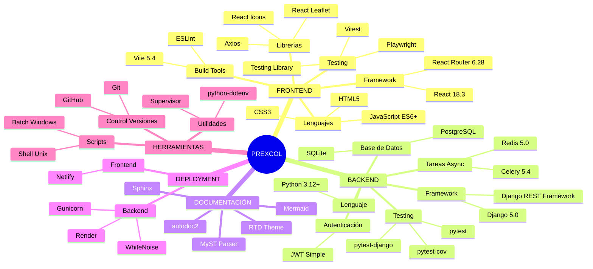

---

## 🔄 Flujo de Datos

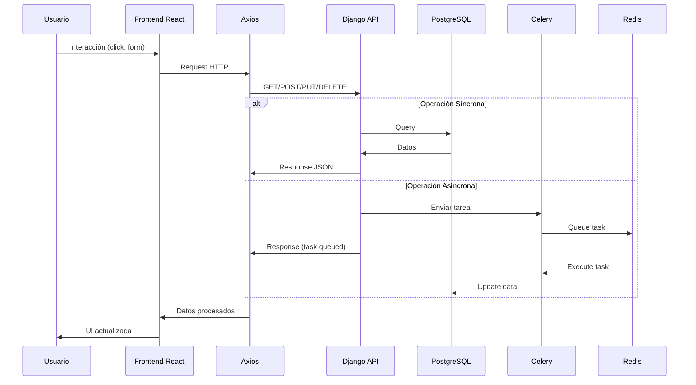

---

## 📦 Estructura de Dependencias

### Backend Dependencies

```mermaid
graph LR
    subgraph "Core Framework"
        A[Django 5.0] --> B[Django REST Framework]
        B --> C[drf-yasg]
        B --> D[djangorestframework-simplejwt]
    end
    
    subgraph "Database"
        E[psycopg2-binary] --> F[(PostgreSQL)]
        G[dj-database-url] --> E
    end
    
    subgraph "Async Tasks"
        H[Celery] --> I[Redis]
        H --> J[supervisor]
    end
    
    subgraph "Utilities"
        K[Pillow]
        L[python-dotenv]
        M[django-cors-headers]
        N[django-filter]
        O[django-ratelimit]
    end
    
    subgraph "Production"
        P[Gunicorn]
        Q[WhiteNoise]
    end
    
    subgraph "Testing"
        R[pytest]
        S[pytest-django]
        T[pytest-cov]
        U[flake8]
    end
    
    subgraph "Documentation"
        V[Sphinx]
        W[sphinx-autodoc2]
        X[myst-parser]
        Y[sphinxcontrib-mermaid]
    end
    
    A --> E
    A --> H
    A --> K
    A --> L
    A --> M
    A --> N
    A --> P
    A --> Q
    
    style A fill:#092e20
    style F fill:#336791
    style I fill:#dc382d
```

### Frontend Dependencies

```mermaid
graph LR
    subgraph "Core"
        A[React 18.3] --> B[React DOM]
        A --> C[React Router DOM]
    end
    
    subgraph "HTTP Client"
        D[Axios]
    end
    
    subgraph "UI Libraries"
        E[React Icons]
        F[React Leaflet] --> G[Leaflet]
    end
    
    subgraph "Build Tools"
        H[Vite] --> I[@vitejs/plugin-react]
    end
    
    subgraph "Testing"
        J[Vitest] --> K[jsdom]
        L[Playwright]
        M[@testing-library/react]
        M --> N[@testing-library/jest-dom]
    end
    
    subgraph "Linting"
        O[ESLint] --> P[eslint-plugin-react-hooks]
        O --> Q[eslint-plugin-react-refresh]
    end
    
    A --> D
    A --> E
    A --> F
    
    style A fill:#61dafb
    style H fill:#646cff
```

---

## 🎯 Mapa de Aprendizaje por Nivel

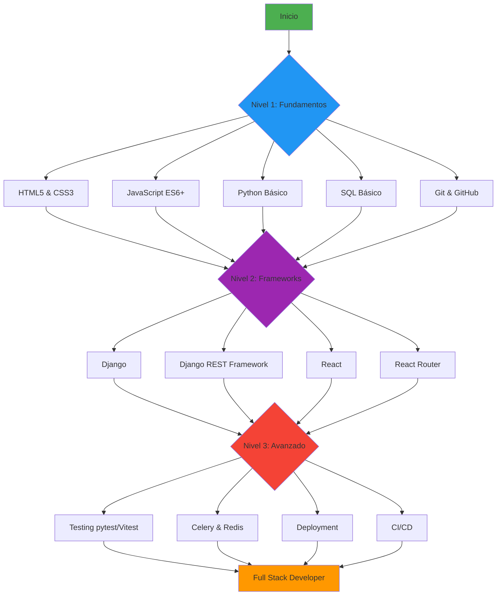

---

## 🔐 Flujo de Autenticación

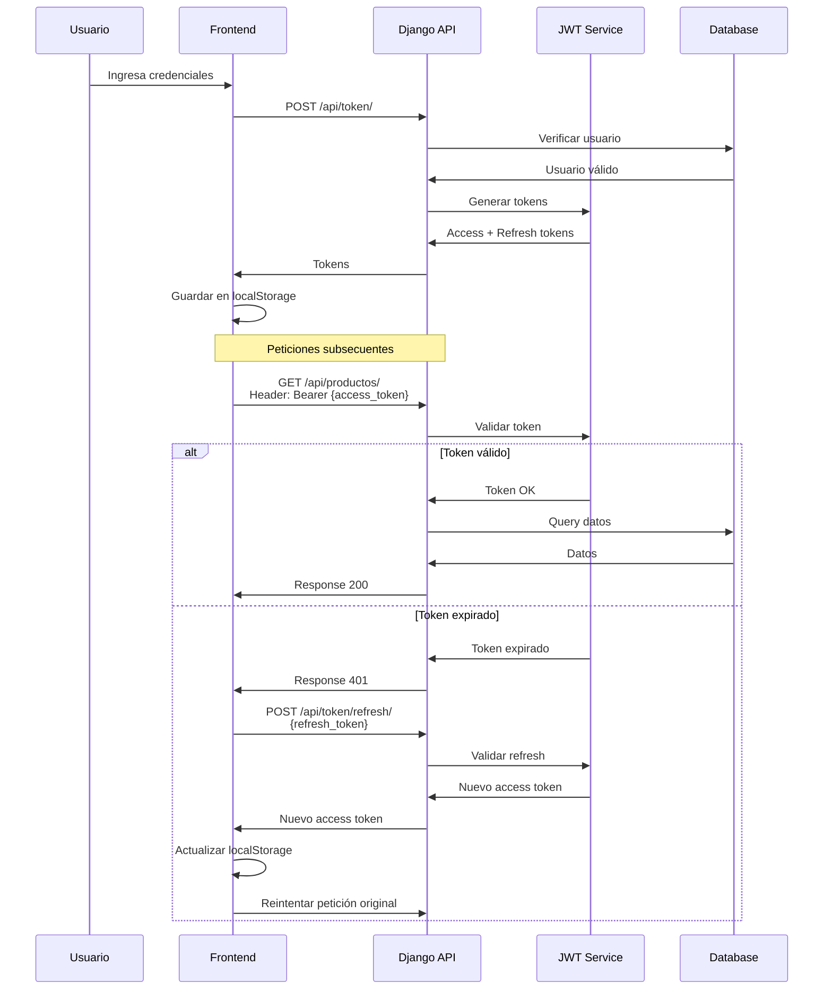

---

## 📁 Estructura de Archivos

```mermaid
graph TD
    ROOT[PREXCOL_FINAL/] --> SRC[src/]
    ROOT --> DOCS[docs/]
    ROOT --> SCRIPTS[scripts/]
    ROOT --> DEPLOY[deployment/]
    
    SRC --> BACKEND[backend/]
    SRC --> FRONTEND[frontend/]
    
    BACKEND --> APPS[apps/]
    BACKEND --> SETTINGS[settings.py]
    BACKEND --> URLS[urls.py]
    BACKEND --> WSGI[wsgi.py]
    
    APPS --> PRODUCTOS[productos/]
    APPS --> PEDIDOS[pedidos/]
    APPS --> USUARIOS[usuarios/]
    APPS --> TIENDAS[tiendas/]
    
    PRODUCTOS --> PMODELS[models.py]
    PRODUCTOS --> PVIEWS[views.py]
    PRODUCTOS --> PSERIALIZERS[serializers.py]
    PRODUCTOS --> PTESTS[tests.py]
    
    FRONTEND --> FSRC[src/]
    FRONTEND --> FPUBLIC[public/]
    FRONTEND --> FCONFIG[vite.config.js]
    
    FSRC --> COMPONENTS[components/]
    FSRC --> PAGES[pages/]
    FSRC --> SERVICES[services/]
    FSRC --> STYLES[styles/]
    
    DOCS --> CONF[conf.py]
    DOCS --> INDEX[index.rst]
    DOCS --> DIAGRAMAS[diagramas/]
    
    SCRIPTS --> START[start_prexcol.bat]
    SCRIPTS --> SETUP[setup_project.bat]
    
    style ROOT fill:#4caf50
    style SRC fill:#2196f3
    style BACKEND fill:#092e20
    style FRONTEND fill:#61dafb
```

---

## 🧩 Componentes del Sistema

```mermaid
graph TB
    subgraph "Capa de Presentación"
        UI[React Components]
        ROUTER[React Router]
        STATE[State Management]
    end
    
    subgraph "Capa de Servicios"
        API_CLIENT[Axios Client]
        AUTH[Auth Service]
        PROD_SVC[Product Service]
        ORDER_SVC[Order Service]
    end
    
    subgraph "Capa de API"
        DRF[Django REST Framework]
        VIEWS[ViewSets]
        SERIALIZERS[Serializers]
        PERMS[Permissions]
    end
    
    subgraph "Capa de Lógica"
        MODELS[Django Models]
        TASKS[Celery Tasks]
        UTILS[Utilities]
    end
    
    subgraph "Capa de Datos"
        POSTGRES[(PostgreSQL)]
        REDIS[(Redis)]
        MEDIA[Media Files]
    end
    
    UI --> ROUTER
    UI --> STATE
    ROUTER --> API_CLIENT
    STATE --> API_CLIENT
    
    API_CLIENT --> AUTH
    API_CLIENT --> PROD_SVC
    API_CLIENT --> ORDER_SVC
    
    AUTH --> DRF
    PROD_SVC --> DRF
    ORDER_SVC --> DRF
    
    DRF --> VIEWS
    VIEWS --> SERIALIZERS
    VIEWS --> PERMS
    
    SERIALIZERS --> MODELS
    PERMS --> MODELS
    VIEWS --> TASKS
    
    MODELS --> POSTGRES
    TASKS --> REDIS
    MODELS --> MEDIA
    
    style UI fill:#61dafb
    style DRF fill:#092e20
    style POSTGRES fill:#336791
    style REDIS fill:#dc382d
```

---

## 🔄 Ciclo de Desarrollo

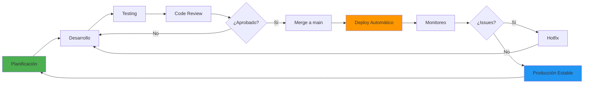

---

## 🛠️ Herramientas por Fase

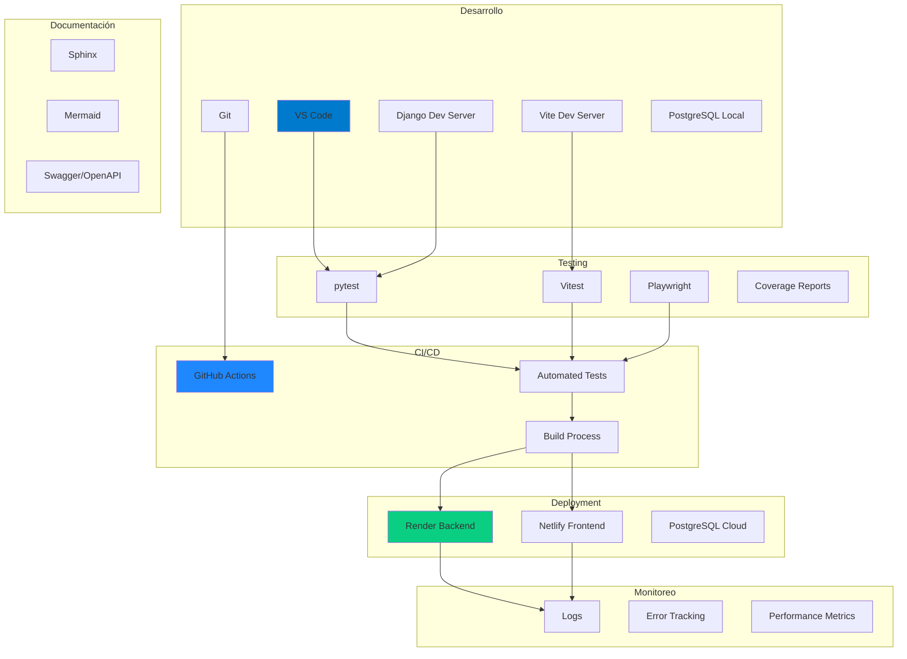

---

## 📊 Comparación de Tecnologías

### Backend Frameworks

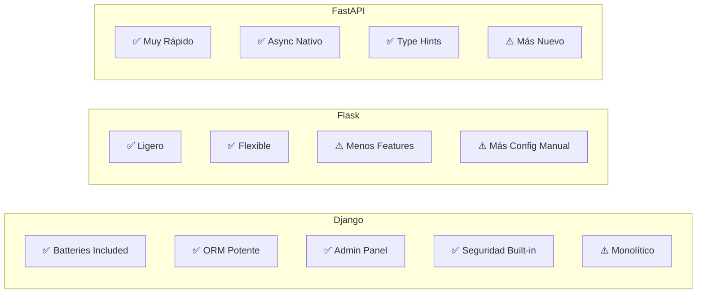

### Frontend Frameworks

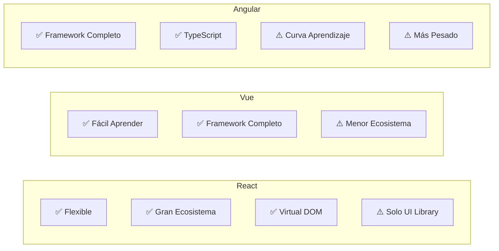

---

## 🎯 Roadmap de Características

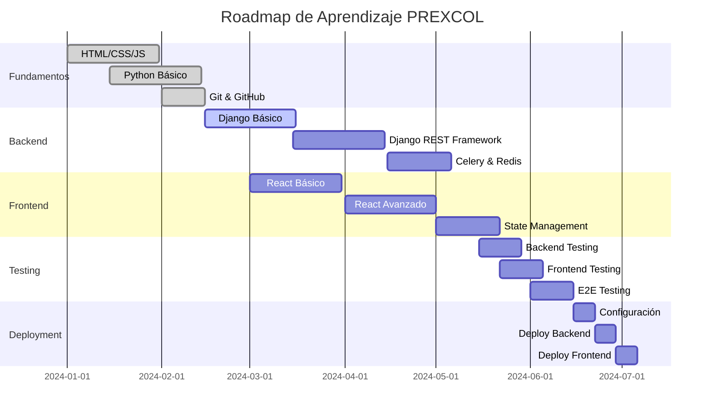

---

## 🔍 Debugging Flow

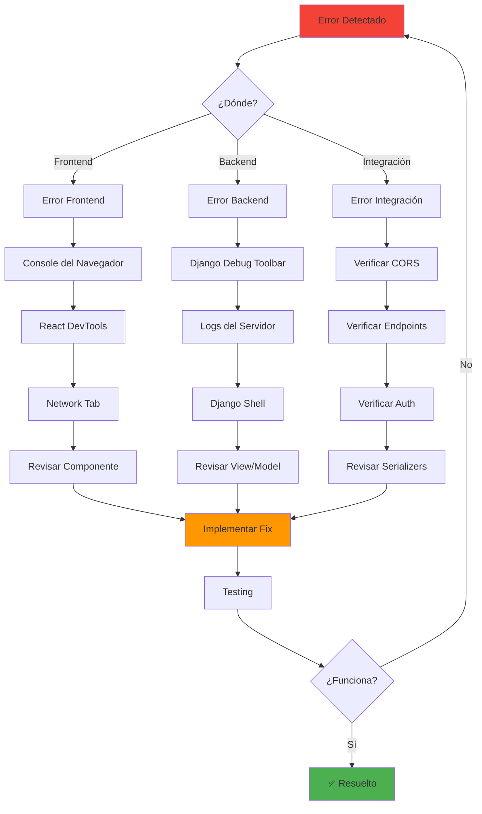

---

## 📈 Métricas de Calidad

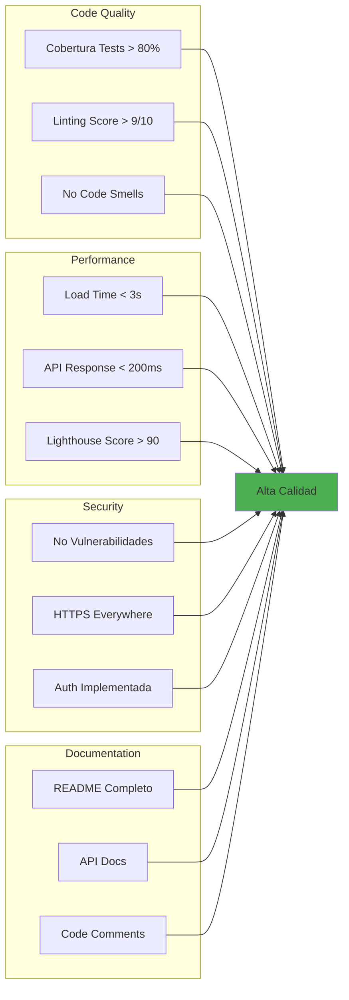

---

## 🎓 Recursos de Aprendizaje por Tecnología

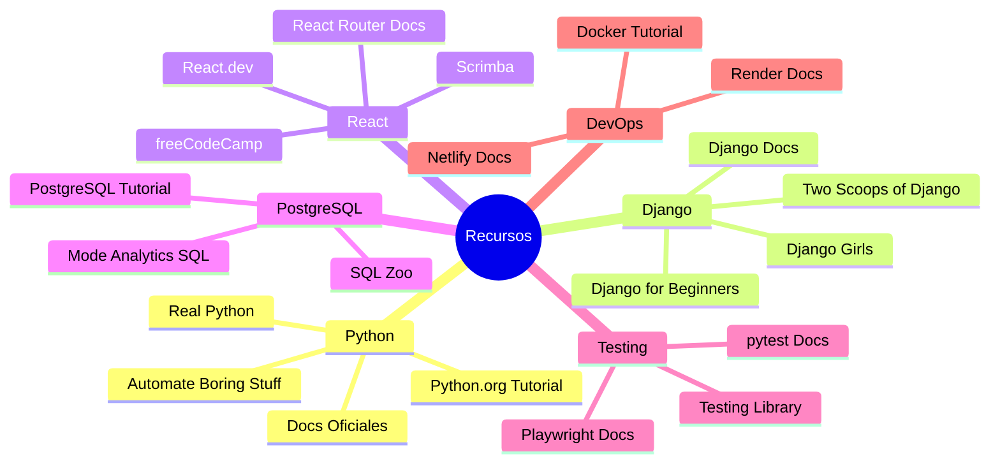

---

**Este mapa visual te ayudará a entender cómo todas las tecnologías se conectan en el proyecto PREXCOL. ¡Úsalo como referencia durante tu aprendizaje! 🚀**
